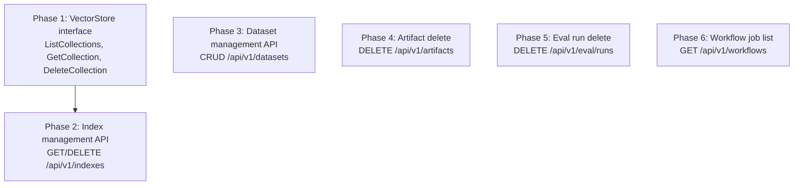

# Go Backend — Phase-wise Implementation Plan

All phases are independent of the React frontend. Each phase is testable via `curl`.

---

## Phase Dependency Map



G1 must be done before G2 (index API depends on new `VectorStore` methods). G3–G6 are independent and can be done in any order.

---

## Phase 1: VectorStore Interface — Collection Management

**Why first**: Index management API needs `ListCollections`, `GetCollection`, `DeleteCollection` on `VectorStore`. Everything else uses existing methods.

### Files to modify

| File | Change |
|------|--------|
| `internal/store/store.go` | Add `CollectionInfo` type + 3 new methods to `VectorStore` interface |
| `internal/store/qdrant.go` | Implement all three against Qdrant gRPC |
| `internal/store/circuitbreaker.go` | Delegate all three through the circuit breaker |
| `internal/store/qdrant_test.go` | Tests for new methods (if applicable) |

### 1.1 Extend `VectorStore` interface

File: `internal/store/store.go`

Add after the `HealthCheck` method:

```go
type CollectionInfo struct {
    Name        string `json:"name"`
    VectorCount uint64 `json:"vector_count"`
    VectorSize  uint64 `json:"vector_size"`
    Distance    string `json:"distance"`
}

type VectorStore interface {
    // ... existing methods ...

    // Collection management
    ListCollections(ctx context.Context) ([]CollectionInfo, error)
    GetCollection(ctx context.Context, name string) (*CollectionInfo, error)
    DeleteCollection(ctx context.Context, name string) error

    HealthCheck(ctx context.Context) error
    Close() error
}
```

### 1.2 Implement on `QdrantStore`

File: `internal/store/qdrant.go`

**`ListCollections`** — uses `s.client.Collections().List()` gRPC call:

```go
func (s *QdrantStore) ListCollections(ctx context.Context) ([]CollectionInfo, error) {
    if s.client == nil {
        return nil, fmt.Errorf("not connected")
    }
    resp, err := s.client.Collections().List(ctx, &qdrant.ListCollectionsRequest{})
    if err != nil {
        return nil, fmt.Errorf("list collections: %w", err)
    }
    collections := resp.GetCollections()
    result := make([]CollectionInfo, 0, len(collections))
    for _, c := range collections {
        info := CollectionInfo{Name: c.GetName()}
        if config := c.GetConfig(); config != nil {
            if params := config.GetParams(); params != nil {
                info.VectorSize = params.GetSize()
                info.Distance = distanceString(params.GetDistance())
            }
        }
        if count := c.GetVectorsCount(); count != nil {
            info.VectorCount = count.GetCount()
        }
        result = append(result, info)
    }
    return result, nil
}
```

**`GetCollection`** — uses `CollectionInfo` gRPC call:

```go
func (s *QdrantStore) GetCollection(ctx context.Context, name string) (*CollectionInfo, error) {
    if s.client == nil {
        return nil, fmt.Errorf("not connected")
    }
    resp, err := s.client.Collections().Get(ctx, &qdrant.GetCollectionInfoRequest{
        CollectionName: name,
    })
    if err != nil {
        st, _ := status.FromError(err)
        if st.Code() == codes.NotFound {
            return nil, fmt.Errorf("%w: %s", ErrCollectionNotFound, name)
        }
        return nil, fmt.Errorf("get collection %s: %w", name, err)
    }
    info := &CollectionInfo{Name: name}
    if result := resp.GetResult(); result != nil {
        if config := result.GetConfig(); config != nil {
            if params := config.GetParams(); params != nil {
                info.VectorSize = params.GetSize()
                info.Distance = distanceString(params.GetDistance())
            }
        }
        if count := result.GetVectorsCount(); count != nil {
            info.VectorCount = count.GetCount()
        }
    }
    return info, nil
}
```

**`DeleteCollection`** — uses `DeleteCollection` gRPC:

```go
func (s *QdrantStore) DeleteCollection(ctx context.Context, name string) error {
    if s.client == nil {
        return fmt.Errorf("not connected")
    }
    _, err := s.client.Collections().Delete(ctx, &qdrant.DeleteCollection{
        CollectionName: name,
    })
    if err != nil {
        st, _ := status.FromError(err)
        if st.Code() == codes.NotFound {
            return fmt.Errorf("%w: %s", ErrCollectionNotFound, name)
        }
        return fmt.Errorf("delete collection %s: %w", name, err)
    }
    return nil
}
```

Add helper + sentinel error:

```go
var ErrCollectionNotFound = fmt.Errorf("collection not found")

func distanceString(d qdrant.Distance) string {
    switch d {
    case qdrant.Distance_Cosine:    return "Cosine"
    case qdrant.Distance_Euclid:    return "Euclid"
    case qdrant.Distance_Dot:       return "Dot"
    case qdrant.Distance_Manhattan: return "Manhattan"
    default:                        return "Unknown"
    }
}
```

### 1.3 Proxy through circuit breaker

File: `internal/store/circuitbreaker.go`

Add three delegation methods (same pattern as existing ones — call underlying store, return `CircuitOpenError` on timeout/connection failure):

```go
func (s *CircuitBreakerVectorStore) ListCollections(ctx context.Context) ([]CollectionInfo, error) {
    // delegate to s.store.ListCollections with circuit breaker logic
    // same pattern as existing Search/Store methods
}

func (s *CircuitBreakerVectorStore) GetCollection(ctx context.Context, name string) (*CollectionInfo, error) {
    // delegate to s.store.GetCollection
}

func (s *CircuitBreakerVectorStore) DeleteCollection(ctx context.Context, name string) error {
    // delegate to s.store.DeleteCollection
}
```

### 1.4 Verification

```bash
# List all Qdrant collections (should include any previously created)
curl http://localhost:8080/api/v1/indexes

# Get single collection details
curl http://localhost:8080/api/v1/indexes/my-collection

# Delete a collection
curl -X DELETE http://localhost:8080/api/v1/indexes/my-collection

# Verify it's gone
curl http://localhost:8080/api/v1/indexes

# Should 404 on deleted/called
curl http://localhost:8080/api/v1/indexes/my-collection  # → 404
```

---

## Phase 2: Index Management API

**Depends on**: Phase 1

### Files to create/modify

| File | Action | Routes |
|------|--------|--------|
| `internal/api/router_index.go` | Create | `GET /api/v1/indexes`, `GET /api/v1/indexes/{name}`, `DELETE /api/v1/indexes/{name}` |
| `internal/api/router_index_test.go` | Create | Tests (mock `VectorStore`) |
| `internal/api/server.go` | Modify | Register `IndexRouter` |

No `service_index.go` needed — the router calls `VectorStore` directly (no Postgres involvement, no complex logic). This follows the same simplicity as `ArtifactRouter` which directly reads disk.

### 2.1 Router

File: `internal/api/router_index.go`

```go
package api

import (
    "errors"
    "net/http"

    "github.com/go-chi/chi/v5"
    qstore "github.com/kaushik2901/raglab/internal/store"
)

type IndexRouter struct {
    store qstore.VectorStore
}

func NewIndexRouter(store qstore.VectorStore) *IndexRouter {
    return &IndexRouter{store: store}
}

func (r *IndexRouter) Register(mux chi.Router) {
    mux.Get("/indexes", r.listHandler)
    mux.Get("/indexes/{name}", r.getHandler)
    mux.Delete("/indexes/{name}", r.deleteHandler)
}

func (r *IndexRouter) listHandler(w http.ResponseWriter, req *http.Request) {
    collections, err := r.store.ListCollections(req.Context())
    if err != nil {
        respondProblem(w, 500, "Internal Server Error", err.Error())
        return
    }
    if collections == nil {
        collections = []qstore.CollectionInfo{}
    }
    respondJSON(w, 200, collections)
}

func (r *IndexRouter) getHandler(w http.ResponseWriter, req *http.Request) {
    name := chi.URLParam(req, "name")
    info, err := r.store.GetCollection(req.Context(), name)
    if err != nil {
        if errors.Is(err, qstore.ErrCollectionNotFound) {
            respondProblem(w, 404, "Not Found", err.Error())
            return
        }
        respondProblem(w, 500, "Internal Server Error", err.Error())
        return
    }
    respondJSON(w, 200, info)
}

func (r *IndexRouter) deleteHandler(w http.ResponseWriter, req *http.Request) {
    name := chi.URLParam(req, "name")
    if err := r.store.DeleteCollection(req.Context(), name); err != nil {
        if errors.Is(err, qstore.ErrCollectionNotFound) {
            respondProblem(w, 404, "Not Found", err.Error())
            return
        }
        respondProblem(w, 500, "Internal Server Error", err.Error())
        return
    }
    respondJSON(w, 200, map[string]string{"deleted": name})
}
```

### 2.2 Register in server.go

File: `internal/api/server.go`

Add in `NewWithDeps`, same pattern as existing routers:

```go
NewIndexRouter(qdrant).Register(r)
```

### 2.3 Verification

```bash
# List indexes
curl http://localhost:8080/api/v1/indexes

# Get one
curl http://localhost:8080/api/v1/indexes/my-collection

# Delete
curl -X DELETE http://localhost:8080/api/v1/indexes/my-collection

# Verify gone → 404
curl http://localhost:8080/api/v1/indexes/my-collection
```

---

## Phase 3: Dataset Management API

**No dependencies** (self-contained, disk I/O only).

### 3.1 Storage layout

```
workspace/
  datasets/                    # flat directory, no tag nesting
    travel-questions.jsonl
    all-docs-questions.jsonl
    ...
```

The path is configured via `DATASETS_DIR` env var, defaulting to `workspace/datasets`.

### 3.2 Files

| File | Action | Routes |
|------|--------|--------|
| `internal/api/router_dataset.go` | Create | `POST /api/v1/datasets`, `GET /api/v1/datasets`, `GET /api/v1/datasets/{name}`, `DELETE /api/v1/datasets/{name}` |
| `internal/api/router_dataset_test.go` | Create | Tests with `t.TempDir()` as datasets dir |
| `internal/api/server.go` | Modify | Register `DatasetRouter` |

### 3.3 Dataset entry type

Add to `internal/api/types.go`:

```go
type DatasetEntry struct {
    Name          string `json:"name"`
    Size          int64  `json:"size"`
    QuestionCount int    `json:"question_count"`
    CreatedAt     string `json:"created_at,omitempty"`
}
```

### 3.4 Router

File: `internal/api/router_dataset.go`

```go
package api

import (
    "bufio"
    "encoding/json"
    "fmt"
    "io"
    "net/http"
    "os"
    "path/filepath"
    "strings"
    "time"

    "github.com/go-chi/chi/v5"
)

type DatasetRouter struct {
    datasetsDir string
}

func NewDatasetRouter(datasetsDir string) *DatasetRouter {
    return &DatasetRouter{datasetsDir: datasetsDir}
}

func (r *DatasetRouter) Register(mux chi.Router) {
    mux.Post("/datasets", r.uploadHandler)
    mux.Get("/datasets", r.listHandler)
    mux.Get("/datasets/{name}", r.downloadHandler)
    mux.Delete("/datasets/{name}", r.deleteHandler)
}

// POST /api/v1/datasets — multipart upload
func (r *DatasetRouter) uploadHandler(w http.ResponseWriter, req *http.Request) {
    // Limit to 500MB
    req.Body = http.MaxBytesReader(w, req.Body, 500<<20)

    if err := req.ParseMultipartForm(32 << 20); err != nil {
        respondProblem(w, 400, "Invalid Request", "failed to parse multipart form: "+err.Error())
        return
    }

    file, header, err := req.FormFile("file")
    if err != nil {
        respondProblem(w, 400, "Invalid Request", "missing 'file' field in form")
        return
    }
    defer file.Close()

    name := header.Filename
    if name == "" {
        respondProblem(w, 400, "Invalid Request", "filename is required")
        return
    }
    if !strings.HasSuffix(strings.ToLower(name), ".jsonl") {
        respondProblem(w, 400, "Invalid Request", "file must have .jsonl extension")
        return
    }

    // Ensure datasets dir exists
    if err := os.MkdirAll(r.datasetsDir, 0o755); err != nil {
        respondProblem(w, 500, "Internal Server Error", "failed to create datasets directory")
        return
    }

    destPath := filepath.Join(r.datasetsDir, filepath.Base(name))
    dest, err := os.Create(destPath)
    if err != nil {
        respondProblem(w, 500, "Internal Server Error", "failed to create file: "+err.Error())
        return
    }
    defer dest.Close()

    written, err := io.Copy(dest, file)
    if err != nil {
        os.Remove(destPath)
        respondProblem(w, 500, "Internal Server Error", "failed to write file: "+err.Error())
        return
    }

    // Count questions by parsing JSONL
    questionCount, parseErr := countJSONLLines(destPath)
    if parseErr != nil {
        os.Remove(destPath)
        respondProblem(w, 400, "Invalid Dataset", "failed to parse JSONL: "+parseErr.Error())
        return
    }

    respondJSON(w, 201, DatasetEntry{
        Name:          name,
        Size:          written,
        QuestionCount: questionCount,
    })
}

// GET /api/v1/datasets — list all
func (r *DatasetRouter) listHandler(w http.ResponseWriter, req *http.Request) {
    entries, err := os.ReadDir(r.datasetsDir)
    if err != nil {
        if os.IsNotExist(err) {
            respondJSON(w, 200, map[string]any{"datasets": []DatasetEntry{}})
            return
        }
        respondProblem(w, 500, "Internal Server Error", "cannot list datasets")
        return
    }

    var datasets []DatasetEntry
    for _, entry := range entries {
        if entry.IsDir() || !strings.HasSuffix(entry.Name(), ".jsonl") {
            continue
        }
        info, err := entry.Info()
        if err != nil {
            continue
        }
        d := DatasetEntry{
            Name:      entry.Name(),
            Size:      info.Size(),
            CreatedAt: info.ModTime().Format(time.RFC3339),
        }
        // Count questions lazily (just for metadata, use cached count if available)
        if qc, err := countJSONLLines(filepath.Join(r.datasetsDir, entry.Name())); err == nil {
            d.QuestionCount = qc
        }
        datasets = append(datasets, d)
    }

    if datasets == nil {
        datasets = []DatasetEntry{}
    }
    respondJSON(w, 200, map[string]any{"datasets": datasets})
}

// GET /api/v1/datasets/{name} — download
func (r *DatasetRouter) downloadHandler(w http.ResponseWriter, req *http.Request) {
    name := chi.URLParam(req, "name")
    path := filepath.Join(r.datasetsDir, filepath.Base(name))

    if _, err := os.Stat(path); os.IsNotExist(err) {
        respondProblem(w, 404, "Not Found", "dataset not found")
        return
    }

    w.Header().Set("Content-Type", "application/x-ndjson")
    w.Header().Set("Content-Disposition", fmt.Sprintf(`attachment; filename="%s"`, name))
    http.ServeFile(w, req, path)
}

// DELETE /api/v1/datasets/{name}
func (r *DatasetRouter) deleteHandler(w http.ResponseWriter, req *http.Request) {
    name := chi.URLParam(req, "name")
    path := filepath.Join(r.datasetsDir, filepath.Base(name))

    if err := os.Remove(path); err != nil {
        if os.IsNotExist(err) {
            respondProblem(w, 404, "Not Found", "dataset not found")
            return
        }
        respondProblem(w, 500, "Internal Server Error", "failed to delete dataset")
        return
    }
    respondJSON(w, 200, map[string]string{"deleted": name})
}

// countJSONLLines validates JSONL and returns number of valid JSON lines
func countJSONLLines(path string) (int, error) {
    f, err := os.Open(path)
    if err != nil {
        return 0, err
    }
    defer f.Close()

    var count int
    scanner := bufio.NewScanner(f)
    scanner.Buffer(make([]byte, 1<<20), 10<<20) // 10MB line buffer for large objects

    for scanner.Scan() {
        line := strings.TrimSpace(scanner.Text())
        if line == "" {
            continue
        }
        // Validate it's valid JSON
        if !json.Valid([]byte(line)) {
            return 0, fmt.Errorf("line %d: invalid JSON", count+1)
        }
        count++
    }
    return count, scanner.Err()
}
```

### 3.5 Register in server.go

Add env var resolution + router registration:

```go
datasetsDir := config.EnvOrDefault("DATASETS_DIR", "workspace/datasets")
NewDatasetRouter(datasetsDir).Register(r)
```

### 3.6 Verification

```bash
# Upload
curl -X POST http://localhost:8080/api/v1/datasets \
  -F "file=@/path/to/questions.jsonl"

# List
curl http://localhost:8080/api/v1/datasets

# Download
curl http://localhost:8080/api/v1/datasets/questions.jsonl

# Delete
curl -X DELETE http://localhost:8080/api/v1/datasets/questions.jsonl

# Verify gone → 404
curl http://localhost:8080/api/v1/datasets/questions.jsonl

# Error: non-JSONL file
curl -X POST http://localhost:8080/api/v1/datasets \
  -F "file=@/path/to/readme.txt"          # → 400

# Error: invalid JSON content
curl -X POST http://localhost:8080/api/v1/datasets \
  -F "file=@/path/to/bad.jsonl"           # → 400 with parse error
```

---

## Phase 4: Artifact Delete

**No dependencies**. Extends existing `ArtifactRouter`.

### Files to modify

| File | Change |
|------|--------|
| `internal/api/router_artifact.go` | Add `DELETE /api/v1/artifacts/{type}/{tag}` handler |

### 4.1 Implementation

File: `internal/api/router_artifact.go`

Add to `Register`:

```go
mux.Delete("/artifacts/{type}/{tag}", r.deleteHandler)
```

Add handler:

```go
func (r *ArtifactRouter) deleteHandler(w http.ResponseWriter, req *http.Request) {
    artifactType := chi.URLParam(req, "type")
    tag := chi.URLParam(req, "tag")

    if artifactType == "" || tag == "" {
        respondProblem(w, 400, "Invalid Parameter", "type and tag are required")
        return
    }

    // Prevent path traversal
    if strings.Contains(artifactType, "..") || strings.Contains(tag, "..") {
        respondProblem(w, 400, "Invalid Parameter", "invalid type or tag")
        return
    }

    dir := filepath.Join(r.artifactsDir, artifactType, tag)
    if _, err := os.Stat(dir); os.IsNotExist(err) {
        respondProblem(w, 404, "Not Found", "artifact not found")
        return
    }

    if err := os.RemoveAll(dir); err != nil {
        respondProblem(w, 500, "Internal Server Error", "failed to delete artifact: "+err.Error())
        return
    }

    respondJSON(w, 200, map[string]string{"deleted": filepath.Join(artifactType, tag)})
}
```

### 4.2 Verification

```bash
# Delete an existing artifact
curl -X DELETE http://localhost:8080/api/v1/artifacts/preprocessing/test-tag

# Verify gone
curl http://localhost:8080/api/v1/artifacts?type=preprocessing&tag=test-tag  # → empty

# Path traversal blocked
curl -X DELETE http://localhost:8080/api/v1/artifacts/../escape/test  # → 400
```

---

## Phase 5: Eval Run Delete

**No dependencies**. Extends existing `EvalRouter` + `EvalService`.

### Files to modify

| File | Change |
|------|--------|
| `internal/api/router_eval.go` | Add `DELETE /api/v1/eval/runs/{id}` handler |
| `internal/api/service_eval.go` | Add `DeleteRun(ctx, id)` method |

### 5.1 Service

File: `internal/api/service_eval.go`

```go
func (s *EvalService) DeleteRun(ctx context.Context, id string) error {
    tag, err := s.pool.Exec(ctx, `DELETE FROM eval_runs WHERE id = $1`, id)
    if err != nil {
        return fmt.Errorf("delete eval run %s: %w", id, err)
    }
    if tag.RowsAffected() == 0 {
        return fmt.Errorf("eval run %s: %w", id, errNotFound) // define sentinel or use pgx.ErrNoRows
    }
    return nil
}
```

`eval_queries` rows are cascade-deleted by the FK (`ON DELETE CASCADE` already in schema).

### 5.2 Router

File: `internal/api/router_eval.go`

Add to `Register`:

```go
mux.Delete("/runs/{id}", r.deleteHandler)
```

Add handler:

```go
func (r *EvalRouter) deleteHandler(w http.ResponseWriter, req *http.Request) {
    id := chi.URLParam(req, "id")
    if err := r.svc.DeleteRun(req.Context(), id); err != nil {
        respondProblem(w, 404, "Not Found", "eval run not found")
        return
    }
    respondJSON(w, 200, map[string]string{"deleted": id})
}
```

### 5.3 Verification

```bash
# Delete an eval run
curl -X DELETE http://localhost:8080/api/v1/eval/runs/<run-uuid>

# Verify gone from list
curl http://localhost:8080/api/v1/eval/runs  # → no longer listed

# Non-existent → 404
curl -X DELETE http://localhost:8080/api/v1/eval/runs/non-existent
```

---

## Phase 6: Workflow Job List

**No dependencies**. Extends existing `WorkflowRouter` + `WorkflowService`.

### Files to modify

| File | Change |
|------|--------|
| `internal/api/router_workflow.go` | Add `GET /api/v1/workflows` handler |
| `internal/api/service_workflow.go` | Add `ListJobs(ctx, kind, state, limit, offset)` method |

### 6.1 Response type

Add to `internal/api/types.go`:

```go
type JobEntry struct {
    ID          int64  `json:"id"`
    Kind        string `json:"kind"`
    State       string `json:"state"`
    Tag         string `json:"tag"`
    Attempt     int    `json:"attempt"`
    MaxAttempts int    `json:"max_attempts"`
    CreatedAt   string `json:"created_at"`
    FinalizedAt string `json:"finalized_at"`
}
```

### 6.2 Service

File: `internal/api/service_workflow.go`

The `jobInserter` interface needs a `JobList` method. Add it or create a separate method using River's job listing capabilities. Since River's Go API provides `JobList` via `river.Client`, add to the interface:

```go
type jobInserter interface {
    Insert(ctx context.Context, args river.JobArgs, opts *river.InsertOpts) (*rivertype.JobInsertResult, error)
    JobGet(ctx context.Context, id int64) (*rivertype.JobRow, error)
    JobList(ctx context.Context, params *river.JobListParams) (*rivertype.JobListResult, error)
}
```

Then the service method:

```go
func (s *WorkflowService) ListJobs(ctx context.Context, kind, state string, limit, offset int) ([]JobEntry, int, error) {
    var kinds []string
    if kind != "" {
        kinds = []string{kind}
    }

    var states []rivertype.JobState
    if state != "" {
        states = append(states, parseJobState(state))
    }

    result, err := s.client.JobList(ctx, &river.JobListParams{
        Kinds:  kinds,
        States: states,
        Limit:  limit,
        Offset: offset,
    })
    if err != nil {
        return nil, 0, fmt.Errorf("list jobs: %w", err)
    }

    jobs := make([]JobEntry, 0, len(result.Jobs))
    for _, j := range result.Jobs {
        entry := JobEntry{
            ID:          j.ID,
            Kind:        j.Kind,
            State:       jobStateString(j.State),
            Attempt:     j.Attempt,
            MaxAttempts: j.MaxAttempts,
        }
        if !j.CreatedAt.IsZero() {
            entry.CreatedAt = j.CreatedAt.Format(time.RFC3339)
        }
        if j.FinalizedAt != nil && !j.FinalizedAt.IsZero() {
            entry.FinalizedAt = j.FinalizedAt.Format(time.RFC3339)
        }
        // Extract tag from job args/meta — handled per-kind
        entry.Tag = extractTagFromJob(j)
        jobs = append(jobs, entry)
    }

    return jobs, result.TotalCount, nil
}
```

**Note**: `extractTagFromJob` depends on how River stores job args. If River's `JobRow` doesn't expose args directly, an alternative is to store `tag` in job metadata via `river.InsertOpts.Metadata` when inserting. This may require updating the `Insert` calls in `InsertPreprocess`, `InsertIndex`, `InsertEval` to pass `Metadata: map[string]string{"tag": req.Tag}`.

### 6.3 Router

File: `internal/api/router_workflow.go`

Add to `Register`:

```go
mux.Get("/", r.listHandler)
```

Add handler:

```go
func (r *WorkflowRouter) listHandler(w http.ResponseWriter, req *http.Request) {
    kind := req.URL.Query().Get("kind")
    state := req.URL.Query().Get("state")
    limit, _ := strconv.Atoi(req.URL.Query().Get("limit"))
    offset, _ := strconv.Atoi(req.URL.Query().Get("offset"))
    if limit <= 0 || limit > 100 {
        limit = 50
    }

    jobs, total, err := r.svc.ListJobs(req.Context(), kind, state, limit, offset)
    if err != nil {
        respondProblem(w, 500, "Internal Server Error", err.Error())
        return
    }
    respondJSON(w, 200, map[string]any{"jobs": jobs, "total": total})
}
```

### 6.4 Verification

```bash
# List all jobs
curl "http://localhost:8080/api/v1/workflows?limit=10"

# Filter by kind
curl "http://localhost:8080/api/v1/workflows?kind=preprocess"

# Filter by state
curl "http://localhost:8080/api/v1/workflows?state=running"

# Combined filter
curl "http://localhost:8080/api/v1/workflows?kind=index&state=completed&limit=5"
```

---

## Summary

| Phase | New/Modified Go files | New API endpoints |
|-------|----------------------|-------------------|
| **G1** | 3 (store.go, qdrant.go, circuitbreaker.go) | 0 (internal only) |
| **G2** | 2 (router_index.go + test, server.go) | 3 |
| **G3** | 2 (router_dataset.go + test, server.go) | 4 |
| **G4** | 1 (router_artifact.go) | 1 |
| **G5** | 2 (router_eval.go, service_eval.go) | 1 |
| **G6** | 3 (router_workflow.go, service_workflow.go, types.go) | 1 |

**Total**: 13 files touched, 10 new API endpoints, 3 new `VectorStore` methods.

---

## Implementation Order Recommendation

```
G1 (VectorStore) → G2 (Index API)
                     G3 (Dataset API)  ← parallel
                     G4 (Artifact delete) ← parallel
                     G5 (Eval delete)     ← parallel
                     G6 (Workflow list)   ← parallel
```

G1→G2 is the only hard dependency (index API needs `ListCollections`/`DeleteCollection` on `VectorStore`). G3 through G6 are independent — do them in any order or parallel.
