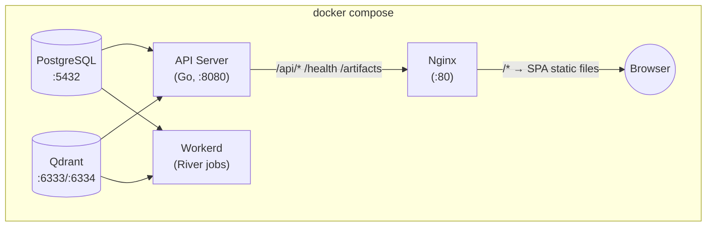
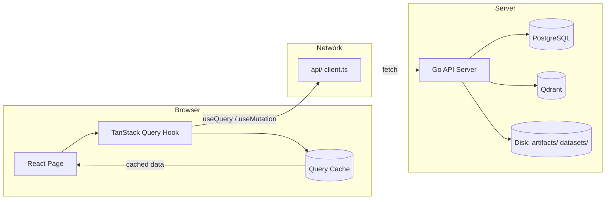
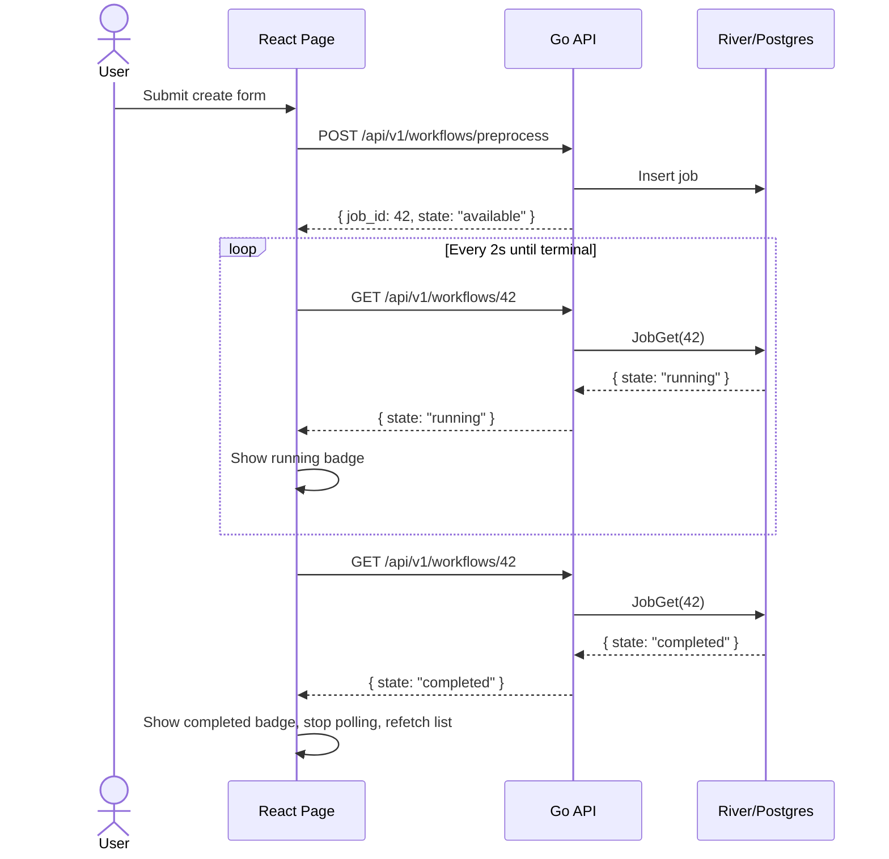
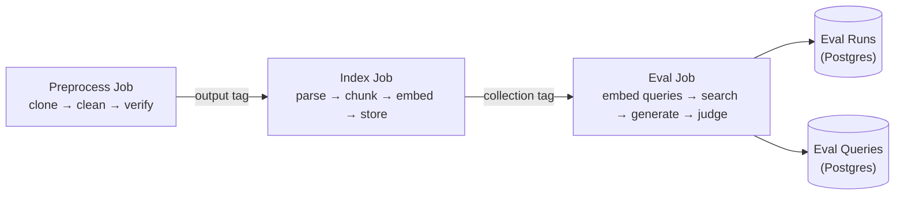

# Web UI — Architecture & Design

## Overview

A single-page application (SPA) for managing the GitLab Handbook RAG pipeline. Covers preprocessing artifacts, golden datasets, Qdrant indexes, evaluation runs with comparison, and job lifecycle monitoring. Served statically by nginx, API calls proxied to the Go API server on the internal Docker network.

## Tech Stack

| Layer | Choice | Rationale |
|-------|--------|-----------|
| Framework | **React 18+** | Required by decision |
| Build tool | **Vite** | Fast HMR, standard React scaffolding |
| Language | **TypeScript** (strict) | Type safety across API contracts |
| Routing | **React Router v7** | Nested layouts, URL params for deep linking |
| Server-state | **TanStack Query v5** | Polling, caching, dedup, error/loading states — no global store needed |
| Components | **shadcn/ui** | Accessible primitives, source-owned (no npm dependency), Tailwind under the hood |
| Styling | **Tailwind CSS** (via shadcn) | Only for layout composition (flex, grid, spacing); shadcn covers component styles |
| HTTP client | Native `fetch` + thin typed wrapper | No axios needed for this scale |
| Serving | **nginx:alpine** | Static file serving + reverse proxy to `api:8080` |

## Docker Integration



The nginx container either:
- **Option A (prod)**: Multi-stage Dockerfile — `node:20-alpine` builds the Vite `dist/`, then `nginx:alpine` serves it. Single `docker build`, no host dependencies.
- **Option B (dev)**: Vite dev server on host (`http://localhost:5173`) with `vite.config.ts` proxy to Docker API. Faster iteration.

Both options use the same nginx config pattern:

```nginx
server {
    listen 80;
    root /usr/share/nginx/html;

    location /api/    { proxy_pass http://api:8080; }
    location /health  { proxy_pass http://api:8080; }
    location /artifacts { proxy_pass http://api:8080; }
    location /        { try_files $uri /index.html; }
}
```

## Directory Structure

```
web/
├── nginx.conf                  # production nginx config (COPY into image)
├── Dockerfile                  # multi-stage: node build → nginx serve
├── package.json
├── tsconfig.json
├── vite.config.ts
├── index.html
├── src/
│   ├── main.tsx                # ReactDOM.createRoot + QueryClientProvider + RouterProvider
│   ├── App.tsx                 # route definitions, Layout wrapper
│   │
│   ├── api/                    # Typed fetch layer (no TanStack Query here)
│   │   ├── client.ts           # base fetch with error normalization
│   │   ├── artifacts.ts        # GET /artifacts, DELETE /artifacts/{type}/{tag}
│   │   ├── datasets.ts         # CRUD /api/v1/datasets
│   │   ├── indexes.ts          # GET/DELETE /api/v1/indexes/{tag}
│   │   ├── evaluations.ts      # GET eval runs, detail, compare, DELETE
│   │   └── workflows.ts        # POST preprocess/index/eval, GET job status, GET job list
│   │
│   ├── hooks/                  # TanStack Query hooks (one file per domain)
│   │   ├── useArtifacts.ts
│   │   ├── useDatasets.ts
│   │   ├── useIndexes.ts
│   │   ├── useEvaluations.ts
│   │   └── useWorkflows.ts
│   │
│   ├── pages/
│   │   ├── Dashboard.tsx
│   │   ├── Artifacts.tsx
│   │   ├── Datasets.tsx
│   │   ├── Indexes.tsx
│   │   ├── Evaluations.tsx
│   │   │   ├── RunList.tsx
│   │   │   ├── RunDetail.tsx
│   │   │   └── RunCompare.tsx
│   │   └── Chat.tsx            # if included
│   │
│   ├── components/
│   │   ├── Layout.tsx          # sidebar nav + header
│   │   ├── ui/                 # shadcn-generated (button, card, table, dialog, tabs, badge, input, select, …)
│   │   ├── JobBadge.tsx        # running/complete/failed pill
│   │   ├── JobTimeline.tsx     # polled job progress with auto-refresh
│   │   ├── MetricsTable.tsx    # side-by-side comparison table for eval runs
│   │   ├── MetricsCards.tsx    # aggregate metric highlight cards
│   │   ├── ConfirmDialog.tsx   # re-usable delete confirmation
│   │   ├── FileUpload.tsx      # multipart upload with progress bar
│   │   └── EmptyState.tsx      # consistent empty-state placeholder
│   │
│   └── lib/
│       ├── utils.ts            # cn() helper (shadcn), formatDuration, etc.
│       └── queryClient.ts      # QueryClient with defaults (staleTime, retry, refetchInterval)
```

## Backend API Gaps

The following endpoints must be added to the Go API server to support the UI.

### Indexes (new)

```
GET    /api/v1/indexes              → list Qdrant collections with stats
GET    /api/v1/indexes/{name}       → single collection detail (vector size, points count)
DELETE /api/v1/indexes/{name}       → drop Qdrant collection
```

Data source: Qdrant gRPC (`ListCollections`, `CollectionInfo`). No Postgres table needed.

**`VectorStore` interface additions:**

```go
type CollectionInfo struct {
    Name        string `json:"name"`
    VectorCount uint64 `json:"vector_count"`
    VectorSize  uint64 `json:"vector_size"`
    Distance    string `json:"distance"`
}

// Add to VectorStore interface:
ListCollections(ctx context.Context) ([]CollectionInfo, error)
GetCollection(ctx context.Context, name string) (*CollectionInfo, error)
DeleteCollection(ctx context.Context, name string) error
```

### Datasets (new)

```
POST   /api/v1/datasets              → multipart upload JSONL file
GET    /api/v1/datasets              → list dataset files
GET    /api/v1/datasets/{name}       → download dataset content
DELETE /api/v1/datasets/{name}       → delete dataset file
```

Stored flat in `datasets/` directory at workspace root. No tag-based namespacing — datasets are independent and reusable across evaluations.

`POST` accepts `multipart/form-data` with a single `file` field. Streams to disk in chunks (no memory pressure on large JSONL files). Returns `{name, size, question_count}`.

### Artifacts (extend existing)

```
DELETE /api/v1/artifacts/{type}/{tag} → remove artifact directory tree
```

### Evaluations (extend existing)

```
DELETE /api/v1/eval/runs/{id}        → delete eval run + all query results (DB cascade)
```

### Workflows (extend existing)

```
GET /api/v1/workflows               → list River jobs, paginated, filterable
```

Query params: `?kind=preprocess|index|eval&state=running|completed|failed&limit=50&offset=0`.

Response:

```json
{
  "jobs": [
    {
      "id": 42,
      "kind": "preprocess",
      "state": "completed",
      "tag": "my-tag",
      "attempt": 1,
      "max_attempts": 3,
      "created_at": "2026-01-01T00:00:00Z",
      "finalized_at": "2026-01-01T00:05:00Z"
    }
  ],
  "total": 150
}
```

This powers the "recent jobs" view on Dashboard and per-page history on Artifacts/Indexes/Evaluations.

## Page Architecture

### 1. Dashboard (`/`)

**Purpose:** Overview of system state. Low priority, but the data hooks are cheap to build.

**Data sources (parallel TanStack Query calls):**
- `useArtifacts()` — artifact count by type
- `useIndexes()` — index count, total vectors
- `useWorkflows({limit: 10})` — recent job activity
- `useEvaluations({limit: 5})` — recent eval runs with aggregate metrics
- `GET /health` — service connectivity

**Layout:** Metric cards (artifact count, index count, eval run count) + recent jobs table + recent eval runs table.

**Polling:** Health check polls every 30s. Jobs list polls every 5s if any running jobs exist.

### 2. Artifacts (`/artifacts`)

**Purpose:** Browse preprocessed artifacts, trigger new preprocessing, delete stale ones.

**Views:**
- **List**: Table of artifacts (type, tag, file count, age). Filter by type.
- **Create**: Form with repo URL, tag, base URL, include dirs → `POST /api/v1/workflows/preprocess`
- **Detail**: Link to associated preprocessing job status (auto-polled)

**Post-submit flow:** Form submission returns `job_id`. The artifact row shows a `JobBadge` that polls `GET /api/v1/workflows/{id}` until `completed` or `failed`. On completion, artifact list refetches to show the new entry.

**Delete:** `ConfirmDialog` → `DELETE /api/v1/artifacts/{type}/{tag}` → invalidate `useArtifacts` cache.

### 3. Datasets (`/datasets`)

**Purpose:** Upload, browse, download, delete golden evaluation datasets (JSONL).

**Views:**
- **List**: Table (name, size, question count, uploaded date)
- **Upload**: `FileUpload` component — drag-and-drop or file picker, multipart streaming upload to `POST /api/v1/datasets` with progress bar
- **Preview** (optional): Fetch dataset content, show first N questions in a read-only table

**Upload flow:** `FileUpload` uses `XMLHttpRequest` (not `fetch`) to get real upload progress events. On success, invalidates `useDatasets` cache.

**Delete:** `ConfirmDialog` → `DELETE /api/v1/datasets/{name}`.

### 4. Indexes (`/indexes`)

**Purpose:** Browse Qdrant collections, create new indexes, delete.

**List columns:** Tag (collection name), vector count, vector size, distance metric.

**Create form:** Select source artifact tag (`GET /artifacts` for dropdown), then configure parser/chunk/embedding params → `POST /api/v1/workflows/index`. Job status polling same pattern as artifacts.

**Delete:** `ConfirmDialog` → `DELETE /api/v1/indexes/{name}` → invalidate cache.

### 5. Evaluations (`/evaluations`)

**Purpose:** The most interactive page. Three sub-views via nested routes:

```
/evaluations                          → RunList
/evaluations/:id                      → RunDetail
/evaluations/:id/compare?to=id2,id3   → RunCompare
```

#### 5a. RunList

Table of all eval runs: tag, dataset, strategy summary, metrics summary (HitRate@5, MRR, Avg Answer Score), date, question count. Each row links to detail view. Selectable rows (checkboxes) for multi-select → "Compare selected" button.

Columns: Run ID (UUID, truncated), Tag, Dataset, K values, HitRate@K, MRR, NDCG@K, Answer Score, Created At, Actions (view, compare, delete).

#### 5b. RunDetail

Full per-question breakdown table with pagination. Columns: Question (truncated), Category, Difficulty, Expected Answer (truncated), Generated Answer (truncated), NDCG, Rank 1st, Answer Score, Latency. Clicking a row expands to show full texts, relevance judgments, retrieved paths.

Aggregate metrics displayed as `MetricsCards` above the table: HitRate@K, MRR, NDCG, Answer Score, Avg Latency, Token Usage.

#### 5c. RunCompare

Side-by-side `MetricsTable`. Up to 5 runs compared.

| Metric | Run A | Run B | Run C (Δ vs A) |
|---|---|---|---|
| HitRate@1 | 0.72 | 0.68 | 0.75 (+0.03) |
| HitRate@5 | 0.89 | 0.85 | 0.92 (+0.03) |
| MRR | 0.81 | 0.78 | 0.84 (+0.03) |
| NDCG@5 | 0.76 | 0.73 | 0.79 (+0.03) |
| Avg Answer Score | 4.12 | 3.95 | 4.35 (+0.23) |
| Avg Latency | 1200ms | 950ms | 1100ms (−100ms) |

Deltas colored: green for improvement, red for regression. Best value per row highlighted.

**Create evaluation:** Form selects index (dropdown from `useIndexes`), dataset (dropdown from `useDatasets`), configures K values, LLM/judge/embedding providers → `POST /api/v1/workflows/eval`. Job polling shows progress, on completion refetches eval runs list.

**Delete:** `DELETE /api/v1/eval/runs/{id}` → invalidate cache.

### 6. Chat (`/chat`) — Optional

If included: streaming chat UI with markdown rendering. Conversation memory managed by the API via `conversation_id`. SSE stream handled via `EventSource`-like reader.

## Data Flow Pattern



Every page follows the same TanStack Query pattern:

```tsx
// hooks/useEvaluations.ts
export function useEvalRuns(page: number) {
  return useQuery({
    queryKey: ['eval-runs', page],
    queryFn: () => fetchEvalRuns({ limit: 20, offset: (page - 1) * 20 }),
    placeholderData: keepPreviousData,  // no flash on pagination
  });
}

export function useEvalRunDetail(id: string) {
  return useQuery({
    queryKey: ['eval-run', id],
    queryFn: () => fetchEvalRunDetail(id),
  });
}
```

**Mutations** (create artifact, delete index, upload dataset) use `useMutation`:

```tsx
export function useDeleteIndex() {
  const queryClient = useQueryClient();
  return useMutation({
    mutationFn: (tag: string) => deleteIndex(tag),
    onSuccess: () => queryClient.invalidateQueries({ queryKey: ['indexes'] }),
  });
}
```

## Polling Strategy

Two patterns, both via TanStack Query `refetchInterval`:

### Pattern A: Job status polling (per-job)

```ts
useQuery({
  queryKey: ['job', jobId],
  queryFn: () => fetchJob(jobId),
  refetchInterval: (query) => {
    const terminal = ['completed', 'failed', 'cancelled', 'discarded'];
    if (query.state.data && terminal.includes(query.state.data.state)) return false;
    return 2000;
  },
});
```

Used by `JobBadge` and `JobTimeline` components. Stops polling once job reaches terminal state. Queued jobs (`available`) poll at 5s interval to avoid excessive calls.

### Pattern B: List polling (dashboard, jobs page)

```ts
useQuery({
  queryKey: ['workflows', { state: 'running' }],
  queryFn: () => fetchWorkflows({ state: 'running' }),
  refetchInterval: 5000,
  enabled: /* only if any non-terminal jobs exist */,
});
```

Dashboard and job list pages poll at 5s intervals **only when running jobs exist**. This avoids pointless polling on idle systems.

### Job Lifecycle Polling Flow



## Pipeline Flow



UI mirrors this chain: Artifacts page → Indexes page → Evaluations page.

## Navigation

```
┌──────────────────────────────────────┐
│  Header bar: Logo + title            │
├──────────┬───────────────────────────┤
│          │                            │
│ Sidebar  │      Page Content          │
│ nav      │                            │
│          │                            │
└──────────┴───────────────────────────┘
```

Sidebar routes: **Dashboard**, **Artifacts**, **Datasets**, **Indexes**, **Evaluations**, **Chat** (optional). Active route highlighted. All internal links use `<Link>` from React Router (no full-page reloads).

## shadcn/ui Components Needed

| Component | Usage |
|-----------|-------|
| `Button` | All actions: create, delete, send, cancel |
| `Card` | Metric cards, form containers |
| `Table` | Every list view |
| `Dialog` | Delete confirmations, create/edit forms |
| `Tabs` | Eval sub-views (runs / detail / compare) |
| `Badge` | Job states, metric highlights |
| `Input` | Form fields |
| `Select` | Provider/model dropdowns |
| `Textarea` | JSON fields (chunk config) |
| `Progress` | File upload progress bar |
| `Skeleton` | Loading placeholders for tables/cards |
| `Sheet` | Mobile sidebar (if needed) |
| `DropdownMenu` | Actions menu (delete, copy ID) |
| `Tooltip` | Truncated cell values, metric descriptions |

## API Error Handling

The Go API returns errors as `application/problem+json`:

```json
{
  "type": "/errors/bad-request",
  "title": "Invalid Parameter",
  "status": 400,
  "detail": "tag is required"
}
```

The `client.ts` wrapper normalizes all errors:

```ts
class ApiError extends Error {
  status: number;
  title: string;
  detail: string;
}

async function apiFetch<T>(url: string, opts?: RequestInit): Promise<T> {
  const res = await fetch(url, opts);
  if (!res.ok) {
    const contentType = res.headers.get('Content-Type') || '';
    if (contentType.includes('problem+json')) {
      const problem = await res.json();
      throw new ApiError(problem.detail, problem.status, problem.title);
    }
    throw new ApiError(res.statusText, res.status);
  }
  const json = await res.json();
  return json.data;  // API wraps responses in { data: ... }
}
```

TanStack Query's `throwOnError` and `onError` callbacks can surface these as toasts (use shadcn's `Sonner` or `Toast`).

## Build & Deploy

### Development

```bash
cd web
npm install
npm run dev
# Vite proxies /api/* → http://localhost:8080 (docker api service)
```

`vite.config.ts`:
```ts
export default defineConfig({
  server: {
    proxy: {
      '/api': 'http://localhost:8080',
      '/health': 'http://localhost:8080',
      '/artifacts': 'http://localhost:8080',
    },
  },
});
```

### Production (Docker multi-stage)

```dockerfile
# web/Dockerfile
FROM node:20-alpine AS build
WORKDIR /app
COPY package*.json ./
RUN npm ci
COPY . .
RUN npm run build

FROM nginx:alpine
COPY nginx.conf /etc/nginx/conf.d/default.conf
COPY --from=build /app/dist /usr/share/nginx/html
```

`docker-compose.yml` addition:
```yaml
nginx:
  build:
    context: ./web
    dockerfile: Dockerfile
  ports:
    - "${WEB_PORT:-80}:80"
  depends_on:
    - api
```

## Open Questions

1. **Chat page inclusion:** Streaming SSE chat UI is a significant effort (markdown rendering, conversation history, token-by-token display). Defer or include?

2. **Authentication:** No auth currently. If needed later, add an nginx `auth_request` subrequest to the Go API, or a simple shared-secret middleware.

3. **Dataset preview size:** Large JSONL files (1000+ questions) should not be fully loaded in-browser. Preview only first 50 rows with explicit "Load more" — or skip preview entirely and just show metadata.

4. **Copy-to-clipboard:** Job IDs, run UUIDs — use `navigator.clipboard.writeText()` with a small toast. Low effort, quality-of-life.
