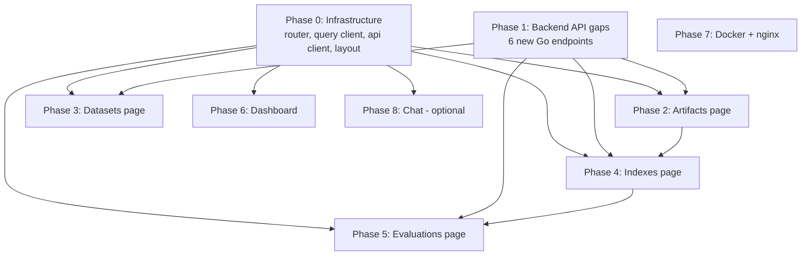
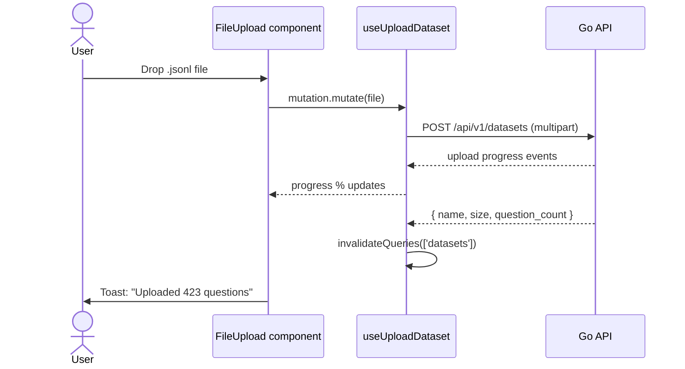

# Web UI — Phase-wise Implementation Plan

## Current Boilerplate State

- **Present**: React 19, Vite 8, TypeScript 6, TanStack Query 5, shadcn/ui (55 components), Tailwind v4, `recharts`, `sonner`, `date-fns`, `clsx`, `tailwind-merge`
- **Missing**: `react-router-dom` (routing), API client layer, pages, query hooks
- **Path alias**: `@/` → `./src` (configured in vite.config.ts)

---

## Phase-by-Phase Dependency Map



---

## Phase 0: Infrastructure Setup

**Goal**: Shell that every page plugs into. Zero business logic. After this phase, `npm run dev` shows a navigable app with empty pages.

### 0.1 Install react-router-dom

```bash
npm install react-router-dom
```

### 0.2 Files to create / modify

| File | Action | Purpose |
|------|--------|---------|
| `src/lib/queryClient.ts` | Create | `QueryClient` with defaults (`staleTime: 30_000`, `refetchOnWindowFocus: false`, `retry: 1`) |
| `src/api/client.ts` | Create | `apiFetch<T>()` — base fetch + error normalization + `{ data }` unwrap |
| `src/api/types.ts` | Create | TypeScript interfaces mirroring Go API responses |
| `src/main.tsx` | Modify | Add `QueryClientProvider` + `BrowserRouter` wrapping `<App />` |
| `src/App.tsx` | Replace | Route definitions with `Layout` wrapper |
| `src/components/Layout.tsx` | Create | Sidebar nav (logo, links, active state highlight) + `<Outlet />` |
| `src/pages/Dashboard.tsx` | Create | Placeholder: "Dashboard coming soon" |
| `src/pages/Artifacts.tsx` | Create | Placeholder (list view) |
| `src/pages/ArtifactCreate.tsx` | Create | Placeholder (create form page) |
| `src/pages/Datasets.tsx` | Create | Placeholder (list + inline upload) |
| `src/pages/Indexes.tsx` | Create | Placeholder (list view) |
| `src/pages/IndexCreate.tsx` | Create | Placeholder (create form page) |
| `src/pages/Evaluations/index.tsx` | Create | Shell with `<Tabs>` and `<Outlet />` |
| `src/pages/Evaluations/RunList.tsx` | Create | Placeholder |
| `src/pages/Evaluations/RunDetail.tsx` | Create | Placeholder |
| `src/pages/Evaluations/RunCompare.tsx` | Create | Placeholder |
| `src/pages/Evaluations/EvalCreate.tsx` | Create | Placeholder (create form page) |
| `src/pages/Chat.tsx` | Create | Placeholder |
| `src/components/EmptyState.tsx` | Create | Reusable icon + message + optional action button for empty lists |
| `src/components/ChipInput.tsx` | Create | Type + Enter to add chips, × to remove. Used for `include_dirs`, `ks` |
| `src/components/ConfirmDialog.tsx` | Create | Reusable delete confirmation with customizable title/body/action |

### 0.3 Route table

```tsx
<Routes>
  <Route element={<Layout />}>
    <Route index element={<Dashboard />} />
    <Route path="artifacts" element={<Artifacts />} />
    <Route path="artifacts/new" element={<ArtifactCreate />} />
    <Route path="datasets" element={<Datasets />} />
    <Route path="indexes" element={<Indexes />} />
    <Route path="indexes/new" element={<IndexCreate />} />
    <Route path="evaluations" element={<Evaluations />}>
      <Route index element={<RunList />} />
      <Route path="new" element={<EvalCreate />} />
      <Route path=":id" element={<RunDetail />} />
      <Route path=":id/compare" element={<RunCompare />} />
    </Route>
    <Route path="chat" element={<Chat />} />
  </Route>
</Routes>
```

**Design principle**: Create flows use dedicated pages (`/artifacts/new`, `/indexes/new`, `/evaluations/new`). Dialog is used only for delete confirmations. Page forms get full viewport real estate — important for multi-section forms with JSON editors and dependent dropdowns.

### 0.4 Verification

- `npm run dev` → app loads, sidebar visible, all 6 nav links work
- `npm run typecheck` passes
- Dark mode toggle works (existing theme provider)

---

## Phase 1: Backend API Gaps (Go)

**Goal**: Six new endpoints to power the UI. Each is self-contained.

### 1.1 VectorStore interface additions

| File | Change |
|------|--------|
| `internal/store/store.go` | Add `CollectionInfo` struct + `ListCollections`, `GetCollection`, `DeleteCollection` to `VectorStore` interface |
| `internal/store/qdrant.go` | Implement all three via Qdrant gRPC (`ListCollections`, `CollectionInfo`, `DeleteCollection`) |
| `internal/store/circuitbreaker.go` | Proxy the three new methods through the circuit breaker |

### 1.2 Index management API

| File | Action | Route |
|------|--------|-------|
| `internal/api/router_index.go` | Create | `GET /api/v1/indexes`, `GET /api/v1/indexes/{name}`, `DELETE /api/v1/indexes/{name}` |
| `internal/api/service_index.go` | Create | Queries `VectorStore` methods, formats response |
| `internal/api/server.go` | Modify | Register `IndexRouter` |

### 1.3 Dataset management API

| File | Action | Route |
|------|--------|-------|
| `internal/api/router_dataset.go` | Create | `POST /api/v1/datasets` (multipart), `GET /api/v1/datasets`, `GET /api/v1/datasets/{name}`, `DELETE /api/v1/datasets/{name}` |
| `internal/api/service_dataset.go` | Create | Multipart parser, disk I/O to `datasets/` dir |
| `internal/api/server.go` | Modify | Register `DatasetRouter` |

### 1.4 Extended existing routers

| File | Change |
|------|--------|
| `internal/api/router_artifact.go` | Add `DELETE /api/v1/artifacts/{type}/{tag}` handler |
| `internal/api/router_eval.go` | Add `DELETE /api/v1/eval/runs/{id}` handler |
| `internal/api/router_workflow.go` | Add `GET /api/v1/workflows` (list jobs, paginated, filterable) |
| `internal/api/service_workflow.go` | Add `ListJobs(ctx, kind, state, limit, offset)` method |
| `internal/api/service_eval.go` | Add `DeleteRun(ctx, id)` method |

### 1.5 Verification

- `go test ./...` passes
- Manual curl testing of each new endpoint against running docker compose stack
- `DELETE /api/v1/indexes/{name}` actually drops Qdrant collection
- Streaming `POST /api/v1/datasets` with 100MB+ file works (no OOM)

---

## Phase 2: Artifacts Page

**Goal**: Browse + create + delete preprocessed artifacts. All wired to real API via TanStack Query hooks.

### 2.1 Files

| File | Action | Purpose |
|------|--------|---------|
| `src/api/artifacts.ts` | Create | `fetchArtifacts()`, `deleteArtifact(type, tag)` |
| `src/api/workflows.ts` | Create | `createPreprocess()`, `createIndex()`, `createEval()`, `fetchJob()`, `fetchJobs()` |
| `src/hooks/useArtifacts.ts` | Create | `useArtifacts()` — merges disk + running jobs; `useDeleteArtifact()` mutation |
| `src/hooks/useWorkflows.ts` | Create | `useCreatePreprocess()`, `useCreateIndex()`, `useCreateEval()`, `useJob(id)`, `useJobs(kind)` |
| `src/pages/Artifacts.tsx` | Replace placeholder | List view with merged data |
| `src/pages/ArtifactCreate.tsx` | Replace placeholder | Create form page with chip input |

### 2.2 Page structure — List view (`/artifacts`)

```
┌─────────────────────────────────────────────────────┐
│  ← Back               Artifacts           [+ New]   │  ← header + CTA links to /artifacts/new
├─────────────────────────────────────────────────────┤
│  [type filter ▼]  [tag search ...]                  │  ← filter bar
├─────────────────────────────────────────────────────┤
│  Type         │ Tag  │ Files │ Actions              │  ← Table (shadcn)
│  preprocessing│ v1   │ 423   │ ⋮ (delete)          │
│  preprocessing│ v2   │ 430   │ ⋮                   │
│  ...                                                │
├─────────────────────────────────────────────────────┤
│  Showing 2 artifacts                                │
└─────────────────────────────────────────────────────┘
```

### 2.2b Create form page (`/artifacts/new`)

```
┌─────────────────────────────────────────────────────┐
│  ← Back to Artifacts      New Artifact              │
├─────────────────────────────────────────────────────┤
│                                                     │
│  ┌─────────────────────────────────────────────┐    │
│  │  repo_url *                                 │    │
│  │  [https://gitlab.com/...handbook.git     ]  │    │
│  │                                             │    │
│  │  tag *                                      │    │
│  │  [v2-june                               ]   │    │
│  │                                             │    │
│  │  base_url (optional)                        │    │
│  │  [https://handbook.gitlab.com           ]   │    │
│  │                                             │    │
│  │  include_dirs (optional)                    │    │
│  │  [content/handbook    ×] [content/eng ×]    │    │
│  │  [________________________]  ← type + Enter │    │
│  │                                             │    │
│  │  [Create]  [Cancel]                         │    │
│  └─────────────────────────────────────────────┘    │
│                                                     │
└─────────────────────────────────────────────────────┘
```

Layout: centered form card (max-w-xl), back link at top. `include_dirs` uses `ChipInput`: user types a path, presses Enter → chip appears with × to remove. Serialized to `["content/handbook","content/engineering"]` on submit.

### 2.3 Data fetching & state transitions

**Merged data pattern**: The artifacts list page fires two parallel queries:

```ts
// hooks/useArtifacts.ts
export function useArtifacts() {
  const diskQuery = useQuery({
    queryKey: ['artifacts', 'disk'],
    queryFn: fetchArtifacts,
  });
  const jobsQuery = useJobs('preprocess'); // running + available preprocess jobs

  // Merge: disk artifacts + pending jobs not yet on disk
  const merged = useMemo(() => {
    const diskTags = new Set(diskQuery.data?.map(a => a.tag) ?? []);
    const pending = (jobsQuery.data ?? [])
      .filter(j => !diskTags.has(j.tag))
      .map(j => ({ tag: j.tag, type: 'preprocessing', pending: true, job: j }));
    return [...(diskQuery.data ?? []), ...pending];
  }, [diskQuery.data, jobsQuery.data]);

  return { data: merged, isLoading: diskQuery.isLoading || jobsQuery.isLoading };
}
```

- **Loading**: `Skeleton` rows in table while both queries resolve
- **Empty**: `EmptyState` — "No artifacts yet." with CTA linking to `/artifacts/new`
- **Error**: Toast via `sonner`
- **Create**: `[+ New]` navigates to `/artifacts/new` → submit → redirect to `/artifacts` with toast → both queries refetch → pending row appears from jobs
- **Polling**: `useJobs` refetches every 5s while any jobs are in `available`/`running` state. Disk query refetches on job completion.
- **Delete**: Row action `⋮` → `ConfirmDialog` → mutation → invalidate `['artifacts', 'disk']`

### 2.4 Verification

- Page loads, shows artifacts from running API (or empty state)
- Delete confirmation dialog works, artifact removed after confirm
- Create form validation shows API error messages inline
- Type filter dropdown works (only `preprocessing` for now, but future-proof)

---

## Phase 3: Datasets Page

**Goal**: Upload + list + delete JSONL evaluation datasets.

### 3.1 Files

| File | Action | Purpose |
|------|--------|---------|
| `src/api/datasets.ts` | Create | `fetchDatasets()`, `uploadDataset(file)`, `deleteDataset(name)` |
| `src/hooks/useDatasets.ts` | Create | `useDatasets()`, `useUploadDataset()`, `useDeleteDataset()` |
| `src/components/FileUpload.tsx` | Create | Drag-and-drop zone + file picker + `Progress` bar |
| `src/pages/Datasets.tsx` | Replace placeholder | Full page |

### 3.2 Upload flow



### 3.3 Table columns

| Name | Size | Questions | Actions |
|------|------|-----------|---------|
| `travel-questions.jsonl` | 1.2 MB | 423 | ↓ Download · 🗑️ Delete |

### 3.4 Verification

- Upload 1MB+ file, progress bar animates
- Upload fails with non-JSONL file, error toast shown
- Table refreshes after successful upload
- Download link streams file
- Delete removes row after confirm

---

## Phase 4: Indexes Page

**Goal**: Browse Qdrant collections + create + delete indexes. Uses merged data pattern (Qdrant collections + running index jobs).

### 4.1 Files

| File | Action | Purpose |
|------|--------|---------|
| `src/api/indexes.ts` | Create | `fetchIndexes()`, `fetchIndex(name)`, `deleteIndex(name)` |
| `src/hooks/useIndexes.ts` | Create | `useIndexes()` — merges Qdrant + running index jobs; `useDeleteIndex()` |
| `src/pages/Indexes.tsx` | Replace placeholder | List view with merged data |
| `src/pages/IndexCreate.tsx` | Replace placeholder | Create form page with structured inputs |

### 4.2 Table columns

| Name | Vectors | Dimensions | Distance | Status |
|------|---------|------------|----------|--------|
| `v1-idx` | 12,450 | 1536 | Cosine | — |
| `handbook-idx` | — | — | — | running ○ |

Pending rows (from jobs, not yet in Qdrant) show `—` for data columns and a `JobBadge` in the Status column. Same merge logic as artifacts: Qdrant result wins on tag collision.

### 4.3 Create form page (`/indexes/new`)

Full-page form with centered card. Sections:

1. **Source**: Artifact `Select` dropdown (populated from `useArtifacts()`)
2. **Identity**: Tag (collection name) text input
3. **Parsing**: `parser_strategy` select (`markdown`), `chunk_strategy` select (`fixed`)
4. **Chunk config**: Two labeled number inputs — **not** a JSON textarea:
   - `size: [512]` (number input)
   - `overlap: [64]` (number input)
   Serialized to `{ size: 512, overlap: 64 }` on submit. No raw JSON visible to user.
5. **Embedding**: Provider select + model text input + batch size number input
6. **Performance**: `index_concurrency` number input + `doc_timeout` text input

Provider select pre-fills model default (e.g., `openai` → `text-embedding-3-small`).

Submit → `useCreateIndex()` mutation → on success redirect to `/indexes` with toast. Cancel → navigate back to `/indexes`.

### 4.4 Verification

- Table shows Qdrant collections from running stack
- Create page dropdown populates from artifacts API
- Delete removes collection from Qdrant and table
- Empty state shows when no collections exist

---

## Phase 5: Evaluations Page

**Goal**: The most complex page. Run list, detail view with per-question breakdown, comparison table. Reuses `recharts` for visual comparison.

### 5.1 Nested routing

```tsx
<Route path="evaluations" element={<Evaluations />}>
  <Route index element={<RunList />} />
  <Route path=":id" element={<RunDetail />} />
  <Route path=":id/compare" element={<RunCompare />} />
</Route>
```

### 5.2 Files

| File | Action | Purpose |
|------|--------|---------|
| `src/api/evaluations.ts` | Create | `fetchRuns()`, `fetchRunDetail(id)`, `compareRuns(baseId, targetIds)`, `deleteRun(id)` |
| `src/hooks/useEvaluations.ts` | Create | `useEvalRuns()`, `useEvalRunDetail(id)`, `useCompareRuns(baseId, targetIds)`, `useDeleteRun()` |
| `src/components/MetricsCards.tsx` | Create | Aggregate metric highlight cards (HitRate, MRR, NDCG, Answer Score) |
| `src/components/MetricsTable.tsx` | Create | Side-by-side comparison table with delta coloring |
| `src/pages/Evaluations/index.tsx` | Replace | Shell with `<Tabs>` and `<Outlet />` |
| `src/pages/Evaluations/RunList.tsx` | Create | Table of eval runs with checkbox multi-select |
| `src/pages/Evaluations/RunDetail.tsx` | Create | Run header + metrics cards + expandable question table |
| `src/pages/Evaluations/RunCompare.tsx` | Create | Side-by-side comparison with deltas + radar chart |
| `src/pages/Evaluations/EvalCreate.tsx` | Create | Full-page create form |

### 5.3 RunList

Table of eval runs with radio + checkboxes for multi-compare selection against a base.

```
┌────┬────┬──────────┬──────────┬─────────┬───────────┬──────┬──────┬────────┬───────────┬────────┐
│Base│ Incl│ Tag     │ Dataset  │ Ks      │ HitRate@5 │ MRR  │ NDCG │ Score  │ Date      │ ⋮      │
├────┼────┼──────────┼──────────┼─────────┼───────────┼──────┼──────┼────────┼───────────┼────────┤
│ ○  │ ☐  │ v1-eval │ travel   │ 1,3,5   │ 0.72      │ 0.68 │ 0.61 │ 3.45   │ 2025-12-28│ View   │
│ ○  │ ☑  │ v2-eval │ travel   │ 1,3,5   │ 0.89      │ 0.81 │ 0.76 │ 4.12   │ 2026-01-01│ Compare│
│ ●  │ ☑  │ v3-eval │ all-docs │ 1,5,10  │ 0.92      │ 0.84 │ 0.79 │ 4.35   │ 2026-01-02│ Delete │
└────┴────┴──────────┴──────────┴─────────┴───────────┴──────┴──────┴────────┴───────────┴────────┘
[Compare 1 run against base v3-eval] [+ New Evaluation]
```

**Selection rules**:
- `Base` column: radio buttons (○/●) — exactly one must be selected to enable comparison
- `Incl` column: checkboxes (☐/☑) — up to 5 rows can be checked. Base row auto-checked and disabled.
- Floating bar appears when ≥1 run is checked (including base): "Compare N runs against base <tag> — [Compare]"
- URL navigates to: `/evaluations/<base-id>/compare?compare_to=<id1>&compare_to=<id2>`
- Eval runs from Postgres appear immediately with null metrics + JobBadge (no merge from jobs needed)

### 5.4 RunDetail

```
┌─────────────────────────────────────────────────────┐
│  [← Back]  test-eval  ·  travel-questions.jsonl    │
│                                                    │
│  ┌──────────┬──────────┬──────────┬──────────────┐ │
│  │ HitRate@5│ MRR      │ NDCG@5   │ Answer Score │ │
│  │   0.89   │  0.81    │  0.76    │    4.12      │ │
│  └──────────┴──────────┴──────────┴──────────────┘ │
│                                                    │
│  Per-question breakdown          [1-50 of 423]  ←   │
│  ┌───────────────────────────────────────────────┐  │
│  │ Q │ Category│ Diff │ NDCG│ Rank│ Score│      │  │
│  ├───────────────────────────────────────────────┤  │
│  │ Q1│ travel  │ easy │ 0.9 │ 1   │ 4.5  │  ▶   │  │
│  │ Q2│ expense │ med  │ 0.7 │ 3   │ 3.0  │  ▶   │  │
│  └───────────────────────────────────────────────┘  │
│                               [← Prev] [Next →]     │
└─────────────────────────────────────────────────────┘
```

Expandable row: clicking ▶ shows full question text, expected answer, generated answer, retrieved paths with scores, relevance judgments.

### 5.5 RunCompare

Base-anchored comparison table. First column is the metric name. Second column is the **base run** (highlighted, no delta). Remaining columns show each compare target with delta vs base. Up to 6 total runs (1 base + up to 5 targets).

```
┌──────────────────┬──────────────┬──────────────────┬──────────────────┐
│ Metric           │ Base (v1)    │ v2 vs Base       │ v3 vs Base       │
├──────────────────┼──────────────┼──────────────────┼──────────────────┤
│ HitRate@5        │ 0.72         │ 0.75 (+0.03 ↑)   │ 0.68 (−0.04 ↓)   │
│ MRR              │ 0.81         │ 0.84 (+0.03 ↑)   │ 0.78 (−0.03 ↓)   │
│ NDCG@5           │ 0.76         │ 0.79 (+0.03 ↑)   │ 0.73 (−0.03 ↓)   │
│ Avg Answer Score │ 4.12         │ 4.35 (+0.23 ↑)   │ 3.95 (−0.17 ↓)   │
│ Avg Latency      │ 1200ms       │ 1100ms (−100ms ↑)│ 1450ms (+250ms ↓) │
│ Avg Prompt Tok   │ 450          │ 520 (+70)        │ 410 (−40)        │
│ Avg Comp Tok     │ 180          │ 210 (+30)        │ 165 (−15)        │
└──────────────────┴──────────────┴──────────────────┴──────────────────┘
```

**Coloring rules**:
- Higher is better (HitRate, MRR, NDCG, Answer Score): `+` delta → green `↑`; `−` delta → red `↓`
- Lower is better (Latency): `−` delta → green `↑`; `+` delta → red `↓`
- Non-directional (Tokens): `+`/`−` in neutral gray, no arrow
- Best value per row across all columns is **bolded**

**Optional**: `recharts` radar chart — base run as a solid thick polygon, compare runs as dashed/dotted polygons. 6 axes: HitRate@5, MRR, NDCG@5, Precision@5, Recall@5, Answer Score.

**API**: `GET /api/v1/eval/runs/{baseId}/compare?compare_to=id1&compare_to=id2`. Returns `{ runs: { baseId: {...}, id1: {...}, id2: {...} } }`. All deltas computed client-side relative to the base run.

**URL is shareable**: `/evaluations/<base>/compare?compare_to=id1&compare_to=id2` can be bookmarked.

### 5.6 Create evaluation page (`/evaluations/new`)

Full-page form with centered card:

```
┌──────────────────────────────────────────────────────────┐
│  ← Back to Evaluations        New Evaluation             │
├──────────────────────────────────────────────────────────┤
│                                                          │
│  ┌──────────────────────────────────────────────────┐    │
│  │  Source                                         │    │
│  │  Index:      [handbook-index ▼]                 │    │
│  │  Dataset:    [travel-questions.jsonl ▼]         │    │
│  │                                                │    │
│  │  Strategy                                      │    │
│  │  Query:      [naive-search ▼]                  │    │
│  │  K values:   [1] [3] [5] [10] [20]  ← chips   │    │
│  │                                                │    │
│  │  LLM                                          │    │
│  │  Provider:   [openai ▼]  Model: [gpt-4o-mini] │    │
│  │                                                │    │
│  │  Embedding                                    │    │
│  │  Provider:   [openai ▼]  Model: [text-emb...] │    │
│  │                                                │    │
│  │  Judge                                        │    │
│  │  Provider:   [openai ▼]  Model: [gpt-4o-mini] │    │
│  │                                                │    │
│  │  Performance                                   │    │
│  │  Batch size: [20]   Workers: [5]               │    │
│  │                                                │    │
│  │  [Create]  [Cancel]                            │    │
│  └──────────────────────────────────────────────────┘    │
│                                                          │
└──────────────────────────────────────────────────────────┘
```

Select dropdowns fetch data on mount: Index from `useIndexes()`, Dataset from `useDatasets()`. Provider selects pre-fill model defaults (e.g., `openai` → `gpt-4o-mini` for LLM/Judge, `text-embedding-3-small` for Embedding). K values are `ChipInput` toggle chips — click to select/deselect, serialized to `[1, 3, 5]` on submit.

Submit → `useCreateEval()` mutation → on success redirects to `/evaluations` with job polling badge on new row. Cancel → navigate back to `/evaluations`.

### 5.7 Verification

- RunList shows eval runs from Postgres (instant visibility, no merge needed), paginated, sortable
- RunList radio (base) + checkbox (targets) selection enables compare button only when ≥1 target checked
- RunDetail shows per-question table, expandable row renders correctly
- RunCompare shows base + compare targets with correct deltas and green/red coloring
- RunCompare URL is shareable and recreates the same view
- Create page dropdowns populate from real data, provider selects update model defaults, K value chips toggle correctly
- Delete removes run, table updates

---

## Phase 6: Dashboard

**Goal**: High-level overview. Parallel queries, metric cards, recent activity.

### 6.1 Files

| File | Action | Purpose |
|------|--------|---------|
| `src/pages/Dashboard.tsx` | Replace placeholder | Full dashboard |
| `src/components/JobTimeline.tsx` | Create | Recent jobs list with `JobBadge` + auto-poll |

### 6.2 Layout

```
┌─────────────────────────────────────────────────────┐
│  Dashboard                                         │
│                                                    │
│  ┌──────────┬──────────┬──────────┬──────────────┐ │
│  │Artifacts │ Indexes  │ Eval Runs│ Datasets     │ │
│  │    2     │    3     │    12    │     4        │ │
│  └──────────┴──────────┴──────────┴──────────────┘ │
│  ┌──────────┬──────────┬──────────┬──────────────┐ │
│  │Postgres  │ Qdrant   │ API      │ Worker       │ │
│  │ ● online │ ● online │ ● online │ ● online     │ │
│  └──────────┴──────────┴──────────┴──────────────┘ │
│                                                    │
│  Recent Jobs                    Recent Eval Runs    │
│  ┌──────────────────────┐ ┌──────────────────────┐ │
│  │ preprocess · complete│ │ test-eval · 0.89 HR@5│ │
│  │ index     · running  │ │ prod-eval · 0.92 HR@5│ │
│  │ preprocess · failed  │ │ base-eval · 0.72 HR@5│ │
│  └──────────────────────┘ └──────────────────────┘ │
└─────────────────────────────────────────────────────┘
```

### 6.3 Data fetching

Parallel `useQuery` calls via `useQueries()`:
- `useArtifacts()` → count
- `useIndexes()` → count
- `useEvalRuns(1)` → count + recent runs
- `useDatasets()` → count
- Health check → service status cards
- `useWorkflows({ limit: 10 })` → recent jobs

### 6.4 Polling

Health check: 30s. Jobs list: 5s only while running jobs exist (Pattern B from architecture doc).

### 6.5 Verification

- Page loads all card counts simultaneously (no waterfall)
- Service status cards reflect live health check
- Recent jobs auto-update when jobs are running
- Clicking a job navigates to relevant page (artifact/index/eval)

---

## Phase 7: Docker + nginx

**Goal**: Production-ready serving. Single `docker compose up -d` brings up the full stack.

### 7.1 Files

| File | Action | Purpose |
|------|--------|---------|
| `web/Dockerfile` | Create | Multi-stage: `node:20-alpine` build → `nginx:alpine` serve |
| `web/nginx.conf` | Create | Reverse proxy config (SPA fallback + API proxy) |
| `docker-compose.yml` | Modify | Add `nginx` service, wire to `api` |

### 7.2 Dockerfile

```dockerfile
FROM node:20-alpine AS build
WORKDIR /app
COPY package*.json ./
RUN npm ci
COPY . .
RUN npm run build

FROM nginx:alpine
COPY nginx.conf /etc/nginx/conf.d/default.conf
COPY --from=build /app/dist /usr/share/nginx/html
EXPOSE 80
```

### 7.3 nginx.conf

```nginx
server {
    listen 80;
    root /usr/share/nginx/html;
    index index.html;

    location /api/      { proxy_pass http://api:8080; }
    location /health    { proxy_pass http://api:8080; }
    location /artifacts { proxy_pass http://api:8080; }

    location / {
        try_files $uri $uri/ /index.html;
    }
}
```

### 7.4 docker-compose addition

```yaml
nginx:
  build:
    context: ./web
    dockerfile: Dockerfile
  ports:
    - "${WEB_PORT:-80}:80"
  depends_on:
    - api
```

### 7.5 Verification

- `docker compose up -d --build nginx` builds and serves
- `http://localhost` loads SPA
- `http://localhost/api/v1/health` returns JSON (proxied)
- Page refresh on `/artifacts` works (SPA fallback)

---

## Phase 8: Chat Page (Optional)

**Goal**: Streaming chat UI if needed.

### 8.1 Files

| File | Action | Purpose |
|------|--------|---------|
| `src/api/chat.ts` | Create | `sendChat()`, `sendChatStream()` |
| `src/pages/Chat.tsx` | Replace placeholder | Full chat UI |
| `src/components/ChatMessage.tsx` | Create | Markdown-rendered message bubble |

### 8.2 Key challenges

- SSE stream parsing with `ReadableStream` reader
- Token-by-token rendering without DOM thrashing
- Markdown rendering (consider `react-markdown` if complex, or simple formatting)
- Conversation memory via `conversation_id`

Defer for now unless explicitly needed.

---

## Summary: Files to Create (by Phase)

| Phase | New files |
|-------|-----------|
| **P0** | 18 files: `queryClient.ts`, `api/client.ts`, `api/types.ts`, `Layout.tsx`, `EmptyState.tsx`, `ChipInput.tsx`, `ConfirmDialog.tsx`, 11 page files (Dashboard, Artifacts list, ArtifactCreate, Datasets, Indexes list, IndexCreate, Evaluations shell + RunList + RunDetail + RunCompare + EvalCreate, Chat) |
| **P1** | ~12 Go files (see Go implementation plan) |
| **P2** | 5 files: `api/artifacts.ts`, `api/workflows.ts` (shared), `hooks/useArtifacts.ts` (with merge), `hooks/useWorkflows.ts`, `pages/Artifacts.tsx` + `pages/ArtifactCreate.tsx` (rewrite both) |
| **P3** | 4 files: `api/datasets.ts`, `hooks/useDatasets.ts`, `components/FileUpload.tsx`, `pages/Datasets.tsx` (rewrite) |
| **P4** | 4 files: `api/indexes.ts`, `hooks/useIndexes.ts` (with merge), `pages/Indexes.tsx` + `pages/IndexCreate.tsx` (rewrite both) |
| **P5** | 8 files: `api/evaluations.ts`, `hooks/useEvaluations.ts`, `MetricsCards.tsx`, `MetricsTable.tsx`, `RunList.tsx`, `RunDetail.tsx`, `RunCompare.tsx`, `EvalCreate.tsx` |
| **P6** | 2 files: `pages/Dashboard.tsx` (rewrite), `components/JobTimeline.tsx` |
| **P7** | 3 files: `Dockerfile`, `nginx.conf`, `docker-compose.yml` (modify) |
| **P8** | 2-3 files: `api/chat.ts`, `pages/Chat.tsx` (rewrite), maybe `components/ChatMessage.tsx` |

**Total**: ~50 new files across 8 phases.
**Dialogs used only for**: `ConfirmDialog` (delete confirmations). All create flows use dedicated pages.
**Structured inputs**: `ChipInput` for `include_dirs` and `ks`; labeled number fields for `chunk_config`. No raw JSON typing.
**Merged data**: Artifacts (disk + preprocess jobs), Indexes (Qdrant + index jobs). Evaluations don't need merge (instant Postgres visibility).

---

## Shared Convention

All TanStack Query hooks follow these patterns:

### Query hook

```ts
// hooks/useThing.ts
import { useQuery, useMutation, useQueryClient } from "@tanstack/react-query";
import * as api from "@/api/thing";

export function useThings() {
  return useQuery({
    queryKey: ["things"],
    queryFn: api.fetchThings,
  });
}
```

### Mutation hook

```ts
export function useDeleteThing() {
  const queryClient = useQueryClient();
  return useMutation({
    mutationFn: api.deleteThing,
    onSuccess: () => queryClient.invalidateQueries({ queryKey: ["things"] }),
  });
}
```

### Merged data hook (artifacts, indexes)

```ts
// hooks/useArtifacts.ts — merge disk/Qdrant data with running jobs
export function useArtifacts() {
  const diskQuery = useQuery({
    queryKey: ["artifacts", "disk"],
    queryFn: api.fetchArtifacts,
  });
  const jobsQuery = useQuery({
    queryKey: ["workflows", "preprocess"],
    queryFn: () => api.fetchJobs({ kind: "preprocess", state: "available,running" }),
    refetchInterval: (q) => {
      const hasRunning = q.state.data?.some(j => j.state !== "completed" && j.state !== "failed");
      return hasRunning ? 5_000 : false;
    },
  });

  const merged = useMemo(() => {
    const diskTags = new Set(diskQuery.data?.map(a => a.tag) ?? []);
    const pending = (jobsQuery.data ?? [])
      .filter(j => !diskTags.has(j.tag))
      .map(j => ({ tag: j.tag, type: "preprocessing", pending: true, job: j }));
    return [...(diskQuery.data ?? []), ...pending];
  }, [diskQuery.data, jobsQuery.data]);

  return { data: merged, isLoading: diskQuery.isLoading || jobsQuery.isLoading };
}
```

### API error handling via sonner toast

```ts
import { toast } from "sonner";

export function useDeleteThing() {
  return useMutation({
    mutationFn: api.deleteThing,
    onSuccess: () => { toast.success("Deleted"); /* invalidate */ },
    onError: (err: ApiError) => { toast.error(err.detail); },
  });
}
```
