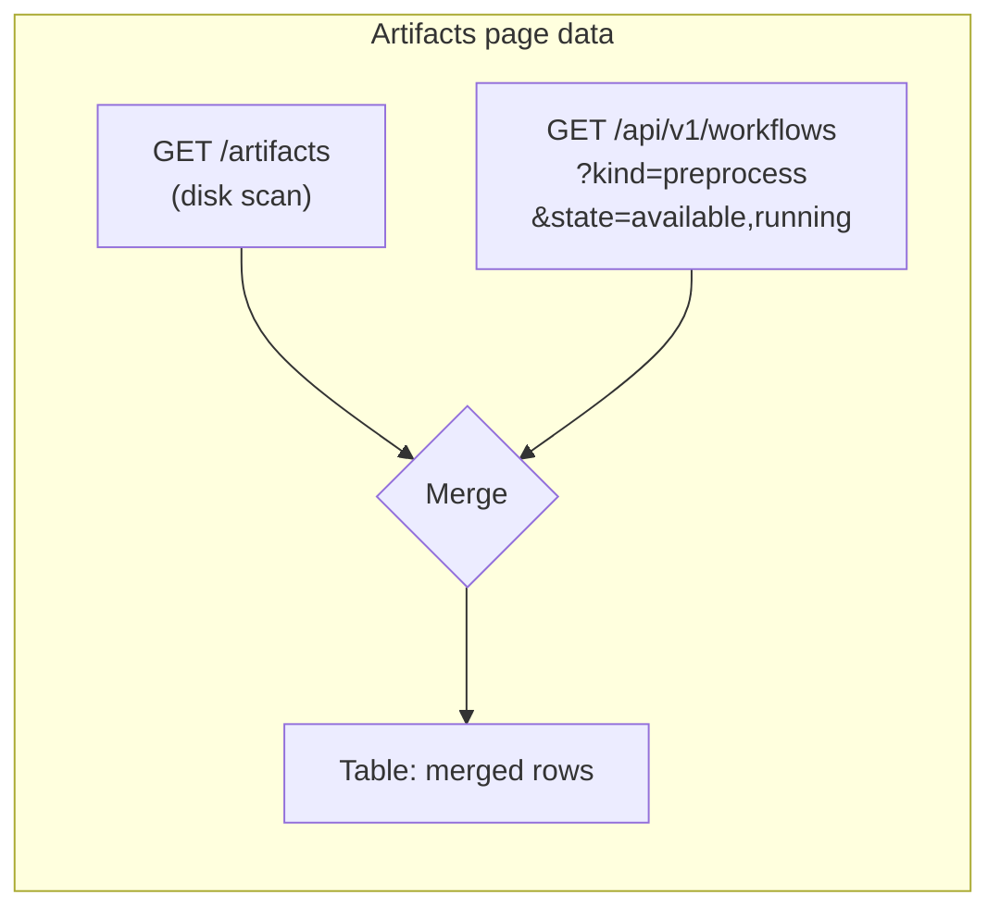
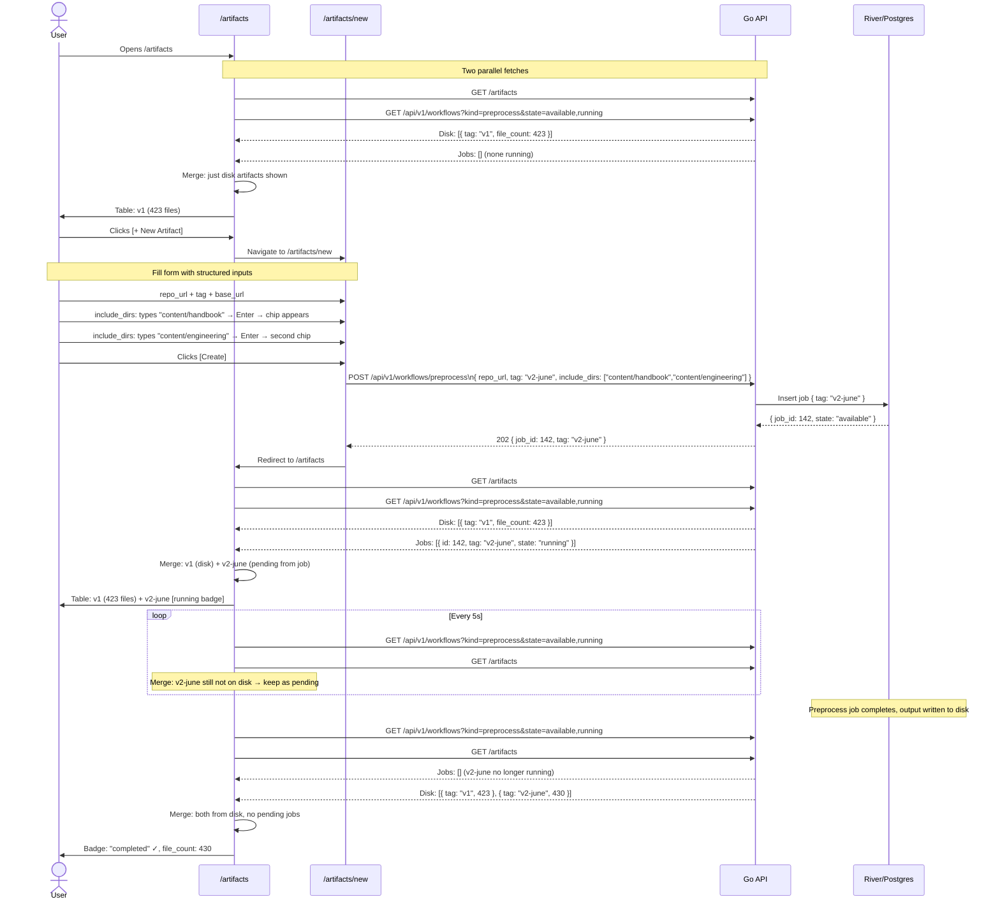
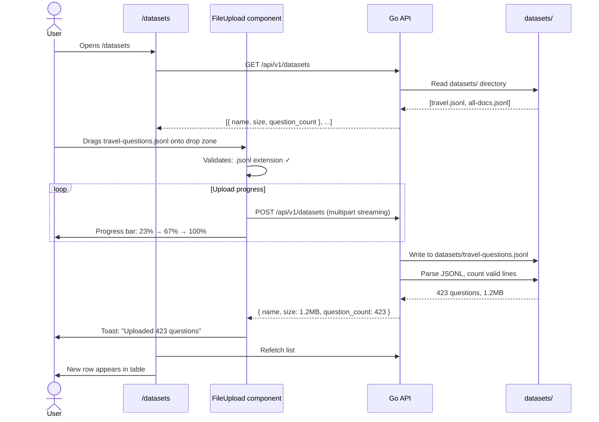
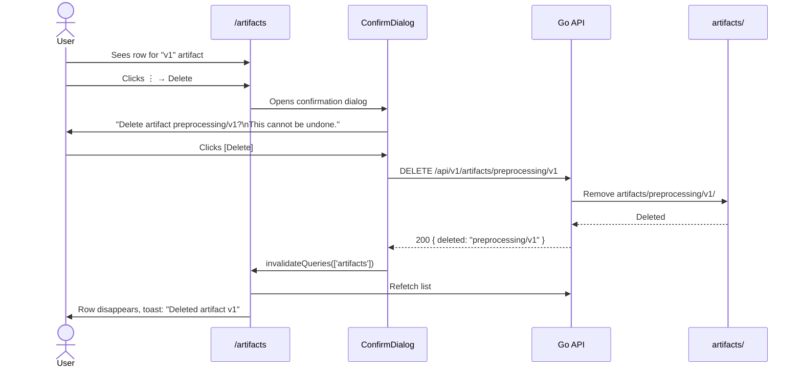
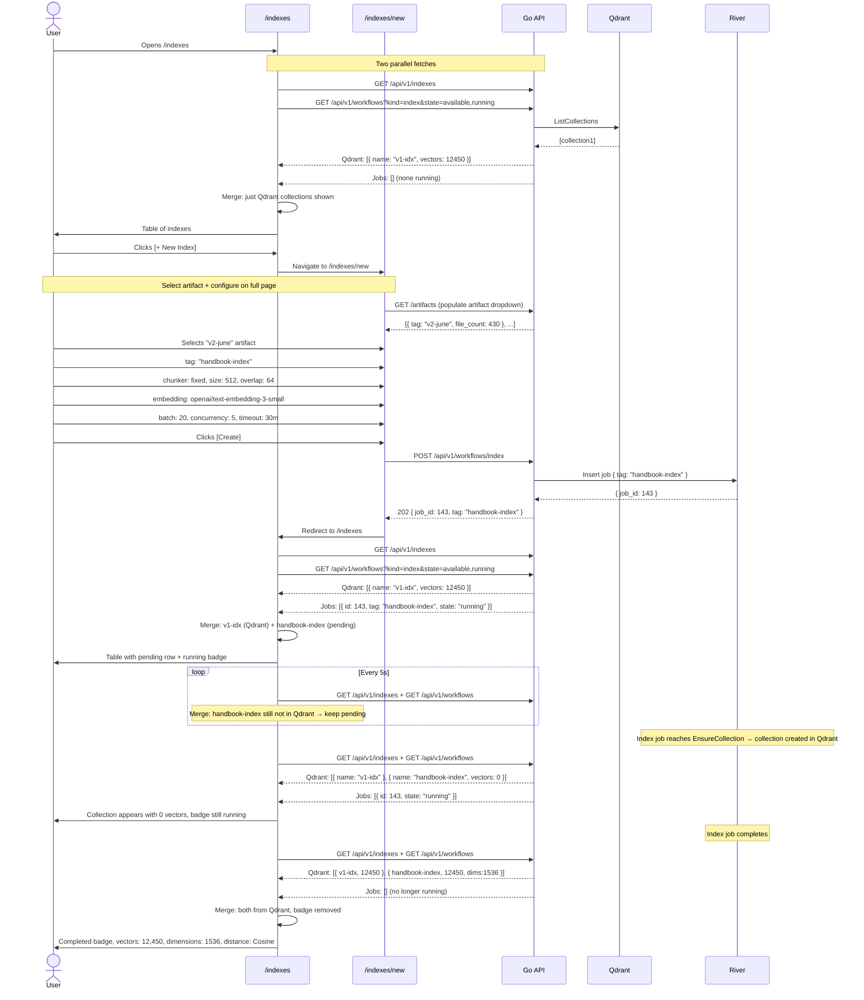
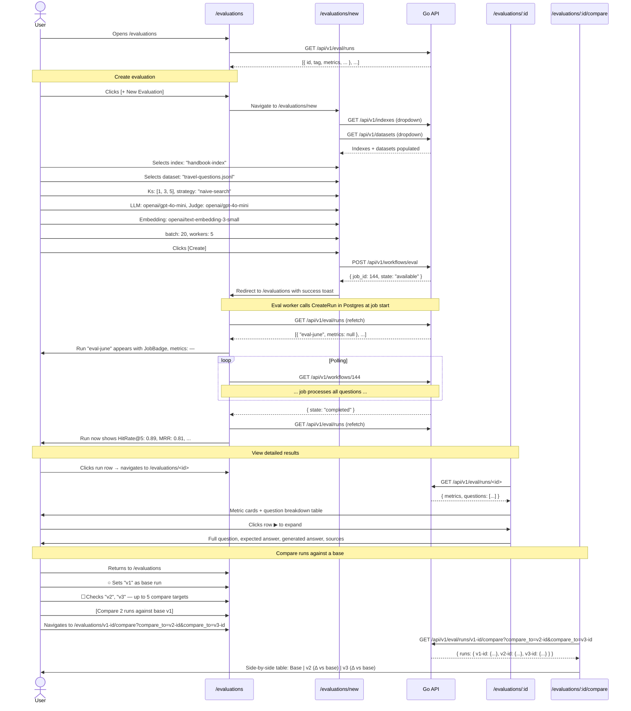
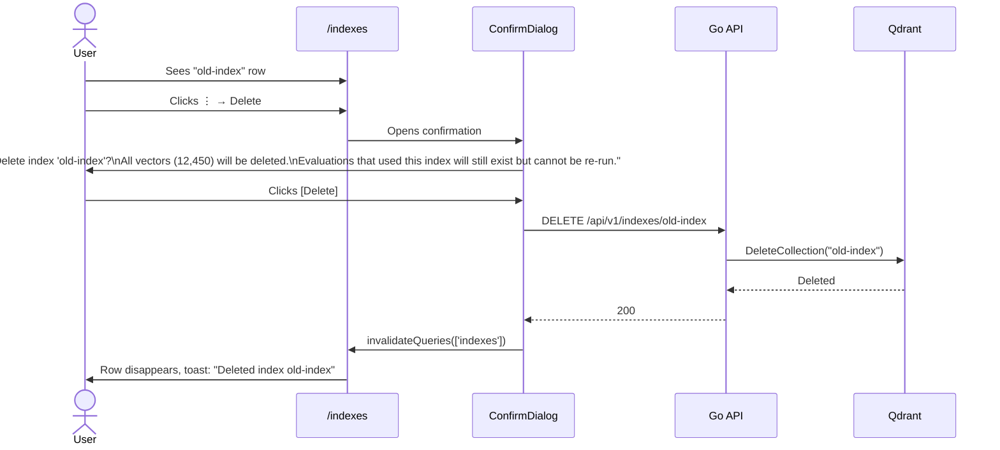
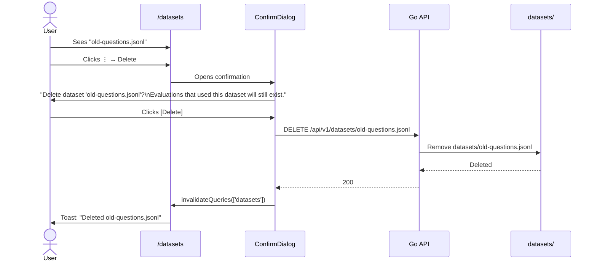
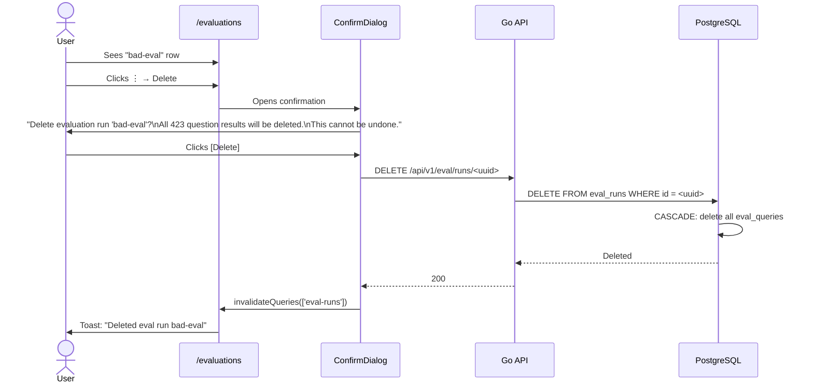
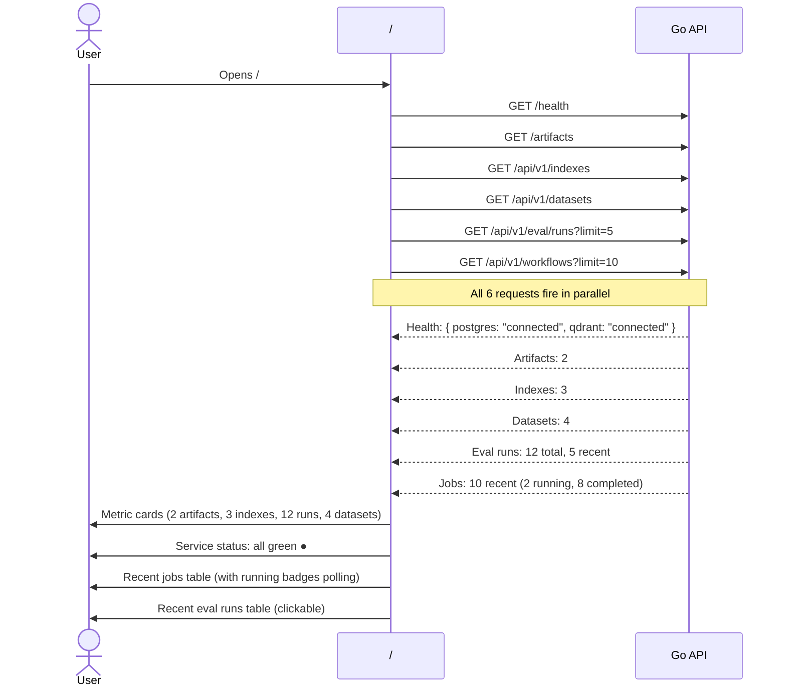

# Web UI — User Interaction Flows

Each flow is a complete end-to-end walkthrough: what the user sees, clicks, and what happens behind the scenes.

---

## Design Decisions

### Form Input: Chips vs Raw JSON

Several workflow parameters accept structured arrays or objects. Instead of making the user type raw JSON strings (error-prone, no validation until submit), use specialized inputs:

| Parameter | Old (JSON text input) | New (structured input) |
|-----------|----------------------|------------------------|
| `include_dirs` | `['content/handbook']` typed manually | **Chip input**: type a path, press Enter → chip appears with × to remove. Array built atomically. |
| `ks` (K values) | `[1,3,5]` typed manually | **Multi-select chips**: row of toggle buttons — `1`, `3`, `5`, `10`, `20`. Each click toggles on/off. Selected chips are highlighted. |
| `chunk_config` | `{"size":512,"overlap":64}` typed in textarea | **Key-value pairs**: two labeled number fields — `size: [512]`, `overlap: [64]`. Rendered inline, no JSON visible to user. |

All three serialize back to their original JSON format before the API call — the API contract doesn't change, only the UX does.

### Showing In-Progress Items in Lists

**Problem**: When a preprocessing job starts, the cloned repo and output files don't exist on disk yet. `GET /artifacts` only returns what's on disk. The user submits a form, gets redirected to the artifacts list, and sees nothing — the new artifact is missing.

Same problem for indexes (`GET /api/v1/indexes` queries Qdrant — collection doesn't exist until the index job reaches `EnsureCollection`).

Evaluations don't have this problem: `CreateRun` inserts into `eval_runs` in Postgres at job start, so the row appears immediately with null metrics.

**Solution**: Each list page merges two data sources client-side:



**Merge rules**:

1. Start with disk artifacts (or Qdrant indexes) as the base rows — these are "ready".
2. Fetch in-progress workflow jobs of the matching kind.
3. For each in-progress job, extract its `tag` from job metadata.
4. If the tag already exists in the base rows → skip (disk/Qdrant result is authoritative).
5. If the tag doesn't exist yet → append a "pending" row with:
   - Tag from job metadata
   - `JobBadge` showing current state (polling)
   - All data fields as `—` (e.g., file count, vector count)
6. When polling detects `completed` → invalidate both queries → refetch. The disk/Qdrant result now includes it, and the job no longer appears in the running jobs list.

### Updated Artifact Creation Sequence



### Step-by-step walkthrough

1. **Landing**: User navigates to `/artifacts`. The page fires two parallel queries:
   - `GET /artifacts` — returns disk artifacts: `[{ tag: "v1", file_count: 423 }]`
   - `GET /api/v1/workflows?kind=preprocess&state=available,running` — returns running preprocess jobs: `[]` (none)

   The page merges: only disk artifacts shown. Table shows v1 with 423 files.

2. **Create trigger**: User clicks the `[+ New Artifact]` button. React Router navigates to `/artifacts/new` — a full-page form.

3. **Fill form**: The create page shows a centered form card with a `← Back to Artifacts` link at top. Fields:
   - `repo_url` (required) — text input, prefilled with handbook repo default
   - `tag` (required) — text input, user types `v2-june`
   - `base_url` (optional) — text input for source URL prefix
   - `include_dirs` (optional) — **chip input**: user types `content/handbook`, presses Enter → a chip appears in the input with an × to remove. User types `content/engineering`, presses Enter → second chip added. Chips: `[content/handbook ×] [content/engineering ×]`. No JSON typing required.

   Each field shows inline validation errors from the API if needed.

4. **Submit**: User clicks `[Create]`. Button shows spinner, fields become read-only. The `useCreatePreprocess()` mutation fires. The chip values are serialized to a JSON array in the request body: `include_dirs: ["content/handbook", "content/engineering"]`.

5. **Immediate feedback**: On success (HTTP 202), user is redirected to `/artifacts`. Toast: "Preprocessing started — job #142".

6. **Merged data appears**: On `/artifacts`, the page refetches both data sources:
   - Disk: `[{ tag: "v1", file_count: 423 }]` — v2-june not on disk yet
   - Jobs: `[{ id: 142, tag: "v2-june", state: "running" }]` — v2-june in progress

   Merge logic: v2-june exists in jobs but not on disk → append as pending row. Table shows:
   ```
   v1          | 423 files | [completed badge]
   v2-june     | —         | [running badge ○]
   ```
   The running badge polls the job every 5s. The entire list also refreshes (both disk + jobs) every 5s while any running jobs exist.

7. **Completion**: When the preprocess job finishes, the output is written to disk. Next refresh cycle:
   - Disk: `[{ tag: "v1", 423 }, { tag: "v2-june", 430 }]` — now on disk
   - Jobs: `[]` — v2-june no longer running
   
   Merge: both from disk, no pending jobs. Table updates:
   ```
   v1          | 423 files | [completed badge]
   v2-june     | 430 files | [completed badge]
   ```

8. **Error states**: If the API returns 400 (validation) or 500 (server error), the form stays on `/artifacts/new` with the error message displayed in a red alert beneath the fields. User can correct and retry. If the job later `failed`, the merged row's badge turns red and a toast shows the error summary.

---

## Flow 2: Upload a Golden Dataset

**Goal**: User uploads a JSONL evaluation dataset file.



### Step-by-step walkthrough

1. **Landing**: User navigates to `/datasets`. Table shows existing datasets: name, size, question count, upload date, and a `⋮` actions menu per row (Download, Delete).

2. **Upload area**: At the top of the page, a `FileUpload` component renders a dashed-border drop zone with text: "Drop a `.jsonl` file here, or click to browse". Below the drop zone is a hidden `Progress` bar (0%).

3. **Select file**: User drags `travel-questions.jsonl` from their file explorer onto the drop zone. The drop zone highlight animates on dragover.

4. **Validation** (client-side): The component checks the file extension. If not `.jsonl`, the drop zone shows a red border and error text: "Only `.jsonl` files are accepted". Doesn't prevent drop but shows warning — the actual validation happens server-side.

5. **Upload starts**: On drop, the `Progress` bar appears and starts filling. A cancel button (✕) appears next to it. The mutation uses `XMLHttpRequest` under the hood to get real upload progress events from the browser.

6. **Progress feedback**: Progress bar fills from 0% to 100% in real time. For a 50MB file on a slow connection, the user sees smooth incremental progress.

7. **Server-side processing**: Once the file is fully received, the Go API:
   - Writes the file to `datasets/travel-questions.jsonl`
   - Opens the file and scans line-by-line
   - Validates each line is valid JSON (so invalid content is caught before the file is saved permanently)
   - Counts valid lines as `question_count`
   - If any line fails JSON validation, deletes the file and returns 400

8. **Success**: Toast notification: "Uploaded: travel-questions.jsonl (423 questions, 1.2 MB)". The datasets table refetches and shows the new row.

9. **Error: Invalid JSONL**: Toast notification: "Upload failed: line 247: invalid JSON". The file is not saved. User fixes their file and retries.

10. **Error: Non-JSONL extension**: Toast: "Upload failed: file must have .jsonl extension".

11. **Cancel upload**: User clicks ✕ on the progress bar → aborts the XHR → clears the upload state.

---

## Flow 3: Delete an Artifact

**Goal**: User removes a stale preprocessed artifact.



### Step-by-step walkthrough

1. **Trigger**: User clicks the `⋮` (actions menu) on an artifact row → selects `Delete`.

2. **Confirmation**: A `ConfirmDialog` (shadcn `AlertDialog`) opens: "Delete artifact preprocessing/v1? This action cannot be undone. Associated indexes will remain in Qdrant."

3. **User confirms**: Clicks red `[Delete]` button. Button shows spinner while mutation is in flight.

4. **Success**: Toast "Deleted artifact preprocessing/v1". The row fades out and the table updates.

5. **Error**: If the artifact directory somehow doesn't exist (race condition), toast shows "Artifact not found". The table refetches anyway to stay in sync.

---

## Flow 4: Create an Index

**Goal**: User creates a Qdrant vector index from a preprocessed artifact.



### Step-by-step walkthrough

1. **Landing**: User is at `/indexes`. Two parallel queries: `GET /api/v1/indexes` (Qdrant) + `GET /api/v1/workflows?kind=index&state=available,running` (in-progress jobs). Merged table shows Qdrant collections normally, plus any in-progress indexing jobs as pending rows with `JobBadge`.

2. **Create trigger**: User clicks `[+ New Index]`. Navigates to `/indexes/new`.

3. **Form fields** (organized in sections, full page):
   - **Source**: Artifact `Select` dropdown — fetches `GET /artifacts` on mount, populates tag options
   - **Identity**: `tag` text input
   - **Parsing**: `parser_strategy` select (`markdown`), `chunk_strategy` select (`fixed`)
   - **Chunk config**: Two labeled number inputs — `size: [512]`, `overlap: [64]`. No raw JSON visible to user. Serialized to `{ size: 512, overlap: 64 }` on submit.
   - **Embedding**: Provider select + model text input + batch size number input
   - **Performance**: Concurrency number + doc timeout text input

4. **Submit**: `[Create]` → `POST /api/v1/workflows/index` → redirect to `/indexes` with toast.

5. **Pending row**: The merged table shows handbook-index as a pending row (no vectors, no dimensions) with running badge. Same merge pattern as artifacts.

6. **Mid-job update**: When `EnsureCollection` runs, the collection appears in Qdrant listing (0 vectors initially). The merged row now shows `vectors: 0`.

7. **Completion**: Job completes, final refetch shows real vector count and dimensions. Badge removed.

---

## Flow 5: Run an Evaluation & Compare Results

**Goal**: User runs an evaluation against an index using a dataset, then compares two runs side-by-side.



### Step-by-step walkthrough

#### 5a. Create the evaluation

1. **Landing**: User navigates to `/evaluations`. Table shows existing eval runs. Each row: checkbox, tag, dataset name, K values, HitRate@5, MRR, NDCG@5, Answer Score, date, `⋮` actions menu.

2. **Create trigger**: User clicks `[+ New Evaluation]`. React Router navigates to `/evaluations/new` — a full-page form.

3. **Form loads**: The create page fetches two datasets in parallel on mount:
   - **Index**: Select dropdown → `GET /api/v1/indexes` → user sees collection names
   - **Dataset**: Select dropdown → `GET /api/v1/datasets` → user sees dataset filenames

4. **Configure**: User fills in:
   - **Index**: `handbook-index`
   - **Dataset**: `travel-questions.jsonl`
   - **K values**: **Multi-select chips** — row of toggle buttons: `[1] [3] [5] [10] [20]`. User clicks `1`, `3`, `5` — selected chips are highlighted. Click again to deselect. Serialized to `[1, 3, 5]` on submit.
   - **Providers**: Three pairs of (provider, model) — LLM, Embedding, Judge. Provider select pre-fills the model field.

5. **Submit**: `[Create]` → `POST /api/v1/workflows/eval`. Returns job_id. Redirects to `/evaluations` with success toast.

6. **Immediate visibility**: Unlike artifacts and indexes, evaluations appear instantly. The eval worker calls `CreateRun` in Postgres at job start. So when the page refetches `GET /api/v1/eval/runs`, the new run is already there — tag visible, all metrics as `—`, `JobBadge` polling. No merge from the jobs endpoint needed.

5. **Job processing**: The eval worker:
   - Batch-embeds all questions
   - Searches against the index at each K value
   - Generates answers via LLM
   - Judges answer quality via Judge LLM
   - Computes metrics (HitRate, MRR, NDCG, etc.)
   - Stores results in `eval_runs` and `eval_queries` Postgres tables

6. **Completion**: Polling detects `completed`. Table refetches. The run row now shows real metrics: HitRate@5: 0.89, MRR: 0.81, etc.

#### 5b. View detailed results

7. **Navigate**: User clicks a run row → React Router navigates to `/evaluations/<uuid>`.

8. **Page layout**:
   - **Top**: Back button `← Evaluations` + run tag + dataset name + date
   - **Metric cards**: 4-6 cards showing aggregate metrics (HitRate@K, MRR, NDCG@K, Avg Answer Score, Avg Latency, Total Tokens)
   - **Question table**: Paginated table (50 per page). Columns: #, Question (truncated to 80 chars), Category, Difficulty, NDCG, Rank 1st, Answer Score, Latency. A `▶` expand button on each row.

9. **Expand row**: User clicks `▶` on a question. The row expands inline (shadcn collapsible pattern) showing:
   - Full question text
   - Expected answer (from dataset)
   - Generated answer (from LLM)
   - Retrieved documents: list of `document_path` + `score` pairs, color-coded by relevance grade (green for highly relevant, yellow for somewhat, red for irrelevant)
   - Token usage: prompt tokens, completion tokens, latency

10. **Pagination**: "Showing 1-50 of 423" with `← Prev` / `Next →` buttons. Uses `placeholderData: keepPreviousData` so table doesn't flash during navigation.

#### 5c. Compare runs against a base

11. **Select runs**: User returns to `/evaluations`. The table has an extra column: a radio button ○ for "set as base" plus checkboxes ☐ for "include in comparison". User picks one base run via radio, then checks up to 5 others via checkboxes. A floating action bar appears: "Compare 3 runs against base run X — [Compare]".

12. **Compare view**: User clicks [Compare] → navigates to `/evaluations/<base-id>/compare?compare_to=<id1>&compare_to=<id2>`. The base run is the anchor — all deltas are computed relative to it.

13. **Metrics table**: Side-by-side table. First column is the metric name. Second column is the **base run** (highlighted, no delta). Remaining columns show each compare run with delta vs base:

    ```
    Metric              Base (v1)    v2 vs Base         v3 vs Base
    ─────────────────────────────────────────────────────────────
    HitRate@5           0.72         0.75 (+0.03 ↑)     0.68 (−0.04 ↓)
    MRR                 0.81         0.84 (+0.03 ↑)     0.78 (−0.03 ↓)
    NDCG@5              0.76         0.79 (+0.03 ↑)     0.73 (−0.03 ↓)
    Avg Answer Score    4.12         4.35 (+0.23 ↑)     3.95 (−0.17 ↓)
    Avg Latency         1200ms       1100ms (−100ms ↑)  1450ms (+250ms ↓)
    ```

    Delta coloring: green with `↑` for improvement, red with `↓` for regression, neutral gray for non-directional metrics (tokens). Best value across all columns is bolded.

14. **URL is shareable**: `/evaluations/<base>/compare?compare_to=id1&compare_to=id2` can be bookmarked or shared. Anyone with access sees the same comparison.

15. **Visual comparison** (optional, using `recharts`): Radar chart overlays base + all compare runs on 6 axes: HitRate@5, MRR, NDCG@5, Precision@5, Recall@5, Answer Score. Base run is a solid thick line; compare runs are dashed/dotted lines in different colors. Hover shows exact values per run.

16. **Modify comparison**: A "Change runs" button returns user to the run list with their previous selection pre-filled. User adjusts checkboxes and re-runs the comparison.

---

## Flow 6: Delete an Index

**Goal**: User removes a Qdrant collection that's no longer needed.



### Step-by-step walkthrough

1. **Trigger**: User clicks `⋮` → `Delete` on an index row.

2. **Confirmation with details**: The dialog shows the index name and warns about vector count and stale evaluation references. This is important because deleting an index is destructive — the vectors are gone immediately.

3. **Success**: Toast "Deleted index old-index". Row removed from table.

---

## Flow 7: Delete a Dataset

**Goal**: User removes a JSONL dataset file.



### Step-by-step walkthrough

Same pattern as other deletes. The confirmation message notes that existing evaluations referencing this dataset will still exist in Postgres — the dataset file is just the input.

---

## Flow 8: Delete an Evaluation Run

**Goal**: User removes an eval run that was a mistake or is no longer relevant.



### Step-by-step walkthrough

Same delete pattern. The confirmation emphasizes that all per-question results (answer scores, generated answers, token counts) are cascade-deleted from Postgres.

---

## Flow 9: Dashboard Check-in

**Goal**: User opens the app to get a quick system overview.



### Step-by-step walkthrough

1. **Load**: User opens `http://localhost` (or `/?tab=dashboard`). The dashboard fires 6 parallel `useQuery` calls.

2. **Metric cards** (top row): Four `Card` components show counts. Each card has an icon, count number, and label. Clicking a card navigates to the relevant page.

3. **Service status** (second row): Four status indicators — Postgres, Qdrant, API, Worker. Green `●` for connected, red `●` for disconnected. The API and Worker are proxied through the health endpoint's additional service checks (if Worker health is exposed).

4. **Recent jobs** (left column): Table of last 10 jobs. Columns: Kind (preprocess/index/eval), Tag, State (badge), Date. Jobs in `running` state show a polling badge that updates every 2s. Clicking a job navigates to its relevant page (e.g., clicking a preprocess job → `/artifacts` with that tag highlighted).

5. **Recent eval runs** (right column): Table of last 5 eval runs with key metrics. Clickable → navigates to run detail.

6. **Polling**: The health check refetches every 30s. The jobs list refreshes every 5s only while running jobs exist (Pattern B).

---

## Summary: UI Patterns Across All Flows

| Pattern | Where used | Implementation |
|---------|-----------|----------------|
| **Create via dedicated page** | Artifact, Index, Eval | Route to `/entity/new` → form page → `useMutation` → redirect → toast |
| **Chip input (array values)** | `include_dirs`, `ks` | Type + Enter adds chip with ×; toggle chips for fixed options. Serialized to JSON array on submit. |
| **Structured fields (object values)** | `chunk_config` | Labeled number inputs (`size`, `overlap`) replace raw JSON textarea. Serialized to JSON object on submit. |
| **Merged data (disk/Qdrant + jobs)** | Artifacts, Indexes | Fire `GET /entity` + `GET /workflows?kind=X&state=running` in parallel. Pending rows from jobs, real rows from disk/Qdrant. Duplicate tags resolved: disk/Qdrant wins. |
| **Immediate Postgres visibility** | Evaluations | No merge needed — `CreateRun` inserts at job start, `GET /eval/runs` returns row immediately with null metrics. |
| **Delete via ConfirmDialog** | Artifact, Dataset, Index, Eval | shadcn `AlertDialog` + `useMutation` → toast → invalidation |
| **Progress upload** | Dataset upload | `XMLHttpRequest` + `Progress` bar |
| **Dependent dropdowns** | Index create, Eval create | `useQuery` populates `Select` options on mount |
| **Expandable row** | Eval run detail | Inline collapsible with full question/answer/sources |
| **Multi-compare against base** | Eval run comparison | Radio (base) + checkboxes (up to 5 targets). URL: `/eval/runs/{base}/compare?compare_to=id1&compare_to=id2`. Deltas always vs base. |
| **Toast notifications** | All mutations | `sonner` — success (green), error (red), info (blue) |
| **Empty state** | All list views when no data | `EmptyState` component with icon + message + CTA button |
